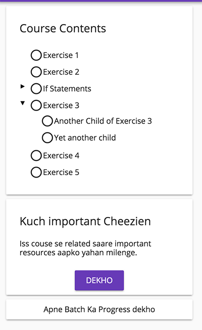

# Newton, the NG Curriculum

The complete structure of a course is explained here. This will help you create a new course in this repo :)

You can also browse through other courses (every directory is a course) to understand more about the structure. 

# Structure of a course on SARAL

This section explains various components which finally make up a course to be put on to our SARAL eLearning platform for the NavGurukul students to learn :)

Every course has a seperate directory within this repo. Like the Python course has a `python` directory, `html` has a `html` directory and so on.

## What are exercises?

Every course is composed of multiple exercises. Exercises can exist at the top level as parent exercises or as child exercises. Currently only a single level of nesting is allowed which means a child exercise cannot have a sub-child.

Every exercise also has a submission type which decided the student interaction with that exercise. A `theory` type of an exercise will just have some reading material without any submission to be done by the student. While a `automatic_submission` type of an exercise will have some theory (or a question) with an option for the student to do a submission. Every exercise is represented by a markdown file. The structure of a single course looks something like this:

```bash
- exercise-1.md
- exercise-2.md
- exercise-3/
		- exercise-3.md # this is parent MD file
		- another-child-of-exercie-3.md # this is the child.
		- yet-another-child.md # the structure of parent/child is defined by index.md
- exercise-4.md
- exercise-5.md
- index.md
- details/
		- info.md
		- details.md
```

This structure will result into something like this on SARAL. The idea is that exercises which don't have child exercises will exist as files in the main course directory. Directories will be created for other exercises.




Here clicking on every Node (Item) will result in the viewing of the contents of the corresponding markdown file.

The `details` directory has two main files, `info.md` and `details.md`

### info.md

This has some meta information of the course which is used when putting the course in the database. Here is a sample file

````markdown
```ngMeta
name: Basics of Programming using Python
type: python
daysToComplete: 45
shortDescription: We will learn the basics of programming using this course.
logo: http://google.com/logo.png
```
````

All the meta information about a course needs to be nested within a `ngMeta` tag in the markdown file.

### details.md

This is the notes file of the course where any course specific notes can be written. They will be displayed on a single view in SARAL. The `Dekho` button in the above screenshot can be used to read the notes inside this file.

## Order of Exercises

The files can be named anything we want as curriculum developers. The order of files (the order in screenshot) is decided by the order written in `index.md` file.

The structure of `index.md` will be like this:

```
exercise-1.md
exercise-2.md
exercise-3/exercise-3.md
	- exercise-3/another-child-of-exercie-3.md
	- exercise-3/yet-another-child.md
```

Notice how `exercise-3` directory has three files inside while the tree structure in the screenshot only has 2 children under it. This is because here in `index.md` the file `exercise-3/exercise-3.md` is marked as a parent exercise while the other two are marked as child. Notice how they are intended in the above snippet. When the learner/student clicks on `Exercise 3` on SARAL (screenshot) the contents of `exercise-3/exercise-3.md` will be shown.


## Images in the course

The images related to a course should exist within directory of the particular course. In case there are a lot of images it can also make sense to have exercise specific directories for images to make organising this easy.

*Note: Image paths in markdown file should be specific relative to the location of the file. You can use `..` to for accessing the contents of the directory above the directory of the markdown file. Similarly `../..` for two directories above.*


## Exercise Submission Types

Exercise in the course can have different submission types. These submission types defines how an exercise can be marked as completed on basis of student behaviour:

1. **`manual`** Exercises with this submission type will have only theory text. They will only be marked as completed when student clicks on the next button to go on the next exercise. 
2. **`auto_file_submission`** This sort of an exercise will be completed when the students submits a file on this exercise. In this sort of an exercise the student can upload any kind of file and it will marked as complete. 
3. **`peer_file_submission`** The students will have to submit a file(s) on this exercise. The file go for an approval to one of his peer learners who has completed the same exercise. It will be marked as complete when the 
4. **`facilitator_file_submission`** This is same as `peer_file_submission`. But in this case the file needs to be reviewed by the facilitator.

## Example Exercise Files

The exercise files are majorly composed of two parts:

1. `ngMeta` section. This section contains the meta information about the exercise like title & submission type. The title of every exercise seen in the screenshot comes from this section.
2. `Actual Content` This is the actual content of the exercise. This content can be anything. Typically this would be Hindi written in Latin (English) script. So basically semantically the only distinction in exercises is on basis of submision types of the exercise. The other parts of the structure remain exactly the same.

Here is an example exercise file:

````markdown
```ngMeta
name: Kaise shuru karein?
completionMethod: manual
```

Lorem ipsum dolor sit amet, consectetur adipiscing elit. Pellentesque vestibulum tellus nisl, vitae ornare sapien placerat eget. Nulla sit amet vestibulum risus. Nunc tincidunt magna ac accumsan mollis. Vivamus at mattis nisi. Curabitur eros ante, tempor sit amet commodo a, finibus eget arcu. Mauris enim nibh, convallis vel libero in, finibus sodales nulla. Suspendisse sed est velit. Phasellus cursus iaculis arcu, quis sodales quam maximus vel. Nam nec sem nec purus suscipit lobortis aliquam eu mauris. Phasellus quis posuere massa. Pellentesque mauris erat, semper quis neque eu, semper sollicitudin turpis. Interdum et malesuada fames ac ante ipsum primis in faucibus. Proin aliquam, leo in hendrerit fermentum, sem nisi posuere odio, id imperdiet elit elit a nibh. Phasellus neque lectus, consectetur in risus sit amet, maximus placerat lorem. In sit amet mi vitae magna luctus vulputate et non leo. Sed gravida ante nibh, eget consequat felis convallis non.

# This is a Heading 1 as per markdown
## This is a Heading 2 as per markdown
### This is a Heading 3 as per markdown
#### This is a Heading 4 as per markdown
##### This is a Heading 5 as per markdown
###### This is a Heading 6 as per markdown

This is an ordered list:
1. Item 1
2. Item 2
3. Item 3

This is unordered list:
- Item x
- Item y
- Item z

When a exercise is shown on SARAL the markdown will be formatted to look pretty just the way you see any web page out there :)
````

You can have a look at all the formatting options in Markdown [here](https://guides.github.com/features/mastering-markdown/)