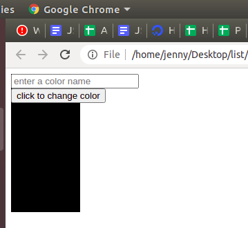

```ngMeta
name: Change the Background color
```

See this video to get to know about [Color flipper](https://drive.google.com/file/d/1Pew8tgx-u7r5CqQo4WE81wZSZyMxsCcB/view?usp=sharing)

Before going to start understanding this [link](https://www.w3schools.com/code/tryit.asp?filename=GRQZT8140PE2) first. How we changed the document's body background color to Red. 

The above link leads to you w3 schools page please click the run button, and you can see 1 more buttion which is written as click here background coloe, please click on it so that you can see that background color of your body changing from white to red.

Personally I like colours so much, so now what we are going to do is , we will ask an input to any user and ask him to enter that colour in an input box so that we will add that favourite color of your friend to a box.



These two files below you can use for getting the output :
[https://github.com/vknayak/JS-projects/blob/main/Project4/index.html](https://github.com/vknayak/JS-projects/blob/main/Project4/index.html)
[https://github.com/vknayak/JS-projects/blob/main/Project4/script.js](https://github.com/vknayak/JS-projects/blob/main/Project4/script.js)

### Script.js

// write a function named changeColor 
   - get the container1 element by using getElementById and store it in a variable
   - get the input1 value by using getElementById and store it in a variable

Hint: If you want to get any input box value what you will do is just after getting that element by the help of id and write .value to it.


### Example:

Var inputBox= document.getElementById(“input1”);
// For getting inputBox value
console.log(inputBox.value);
 
   - update the background color of container1 by the input1 value
   - And clear the input that user enter to empty value


