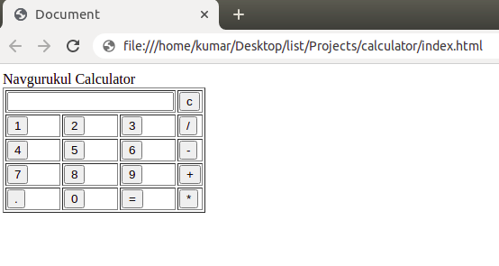
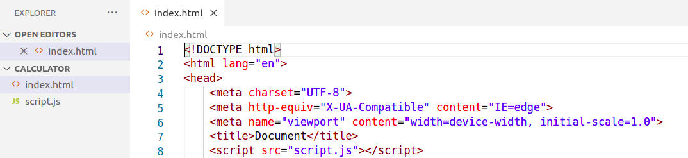

```ngMeta
name: Calculator
```

See this [video](https://drive.google.com/file/d/1c4_-nPv7amB3cgLUSk-Y6ooH9U2RFJnU/view?usp=sharing) to get to know about calculator.

We are going to do a calculator which we can use on the web.

This is where you will get [basic html code](https://github.com/vknayak/JS-projects/blob/main/Project5/index.html) for a calculator. We have to work on html elements to get the data.



Script file that is to be used in a calculator where we have our functions to do the computations.

[https://github.com/vknayak/JS-projects/blob/main/Project5/script.js](https://github.com/vknayak/JS-projects/blob/main/Project5/script.js)



function that display value

write a function name display which takes an argument value and display it to screen and get the element td which has the id of screen and add the

current value
 
   - take an argument value that user pressed
   - Add the value that came from function to screen value by assignment operator
 
 
function that evaluates the digit and return result after computing

write another function named solve which takes no argument which evaluates the expression .... ??
    - get the expression that came after pressing equal to and store it in a variable
   - and use eval to compute the mathematical expression
   - and again the screen with the value that came after computing
 
function that clear the display

write a another function name clear which takes no  argument which clears the expression that is there on screen
     - update the value of screen to empty string
     
write clear function here


