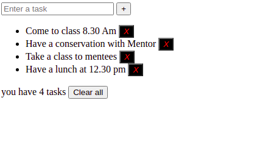

```ngMeta
name: Todo Application
```

### Local Storage

Think how banks are doing login work for their users and how they are saying that your session time is out when you are logged in and leave it like that only and please login again? How? How ? How? 

Please go through this to find a solution.

[https://blog.logrocket.com/localstorage-javascript-complete-guide/](https://blog.logrocket.com/localstorage-javascript-complete-guide/)


You understood right how to store details as key value pairs.

### Todo Application

[video](https://drive.google.com/file/d/1X2q-UQzn3HhHEHPr63U9mV9Axoo4g6qR/view?usp=sharing)

Here you need to make a bucket list of tasks that you need to do this we can use for further reference how we are organizing our tasks. You can make it as advanced things and also think on it and improvise too if you want.



[https://github.com/vknayak/JS-projects/blob/main/Project6/index.html](https://github.com/vknayak/JS-projects/blob/main/Project6/index.html)

[https://github.com/vknayak/JS-projects/blob/main/Project6/script.js](https://github.com/vknayak/JS-projects/blob/main/Project6/script.js)

In our todo application how much of work we have, 
First work - adding a task whatever that he enters into an input.
Second work - Showing tasks after added a task from input
Third work - give an option to clear all task
Fourth work- give a delete option to each task

#### Function

write a function addBtn which do subtasks mention below
 - get the input1 value whatever the user is entering for task
 - get the local storage values by getItem function if it is null create a new list or parse it after getting from local storage into normal list
 - push the new task that you got from input1 and set that in localstorage by using setItem function
 - and show all tasks function is useful to show the tasks to you, after adding current task to the new list give that as a parameter to showtasks then show task will show you the tasks in li.
 
### function Showtasks 

write a function ShowTasks is which will do
 - got the list as a parameter and it will help you to show the list
 - get the input1 value whatever the user is entering for task
 - get the todolist value where you want to save all the todos by writing
See the ul tag in html, it is empty you need to fill that by using li aka listItems
 - get the footer value for writing the how many tasks that you have
 - get the local storage values by getItem function if it is null create a new list or parse it after getting from local storage into normal list
 - After getting all tods from localstorage we need to run a loop for creating a list of tasks that defines each task with a button of deeleteTodo. deleteTodo function which will take 1 parameter of the index of each task

Read this to understand how to give the [innerHtml value](https://www.w3schools.com/jsref/prop_html_innerhtml.asp).

 - Update the todolist value with all lists that we made
 - Update footer value with the total task that we have and say them that you have these many tasks todo
 - and update the input1 value means that input box value should to empty
 

 
### Fucntion clearALl, 
which will do
 - clear all todos by emptying the localstorage values by using removeItem
 - and update the footer value also to zero tasks because after deleting there are no tasks to do
 - And no list items means not tasks need to show in web page
 

### Function deleteTodo

which takes 1 parameter of index value from the task and use that index to find the task and delete that task and show remaining tasks  after deleting the particular send the remaining list to showtasks function and it will show the remaining tasks.

