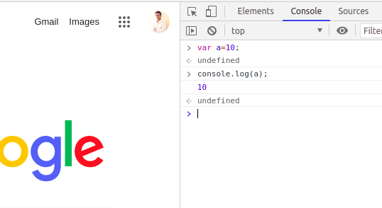
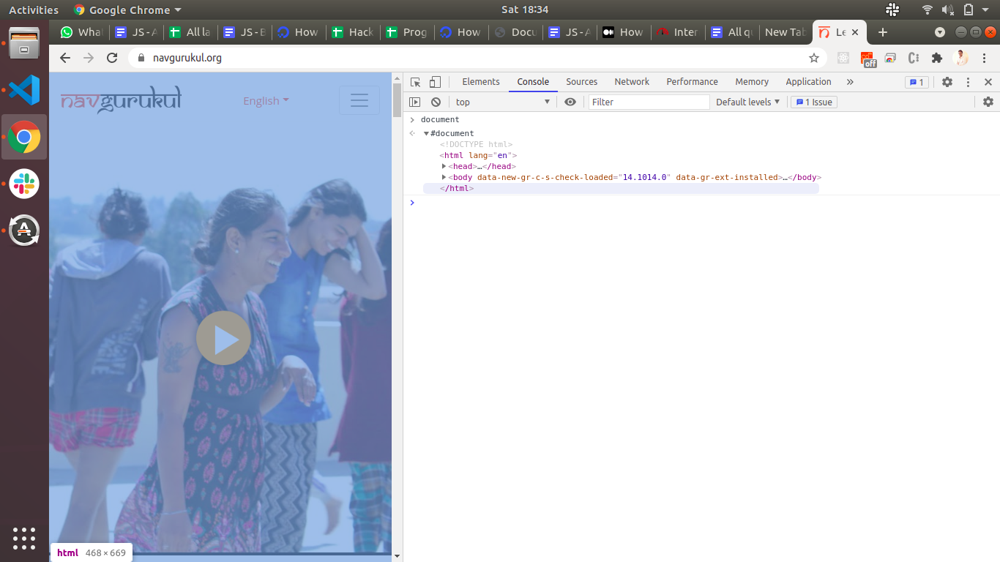
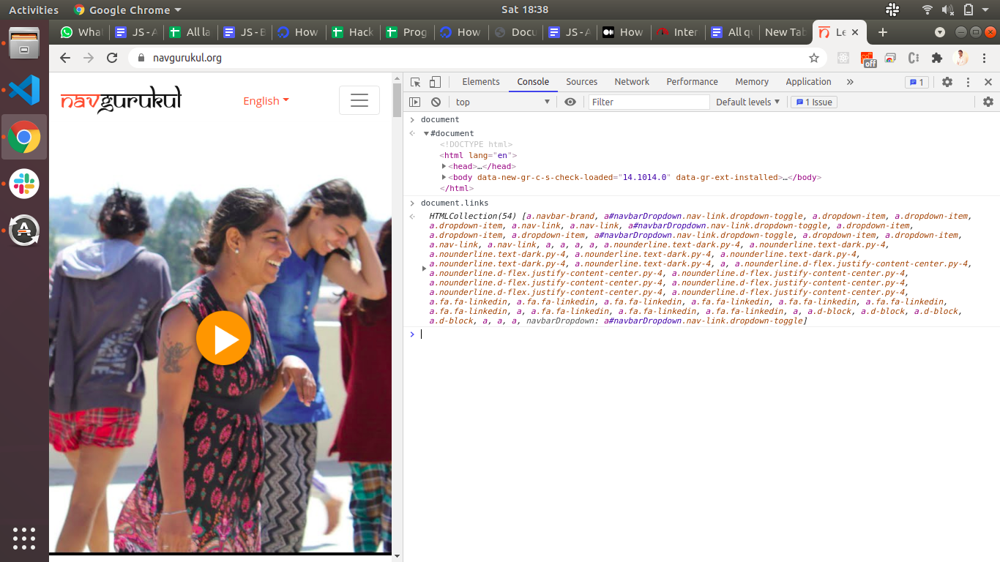
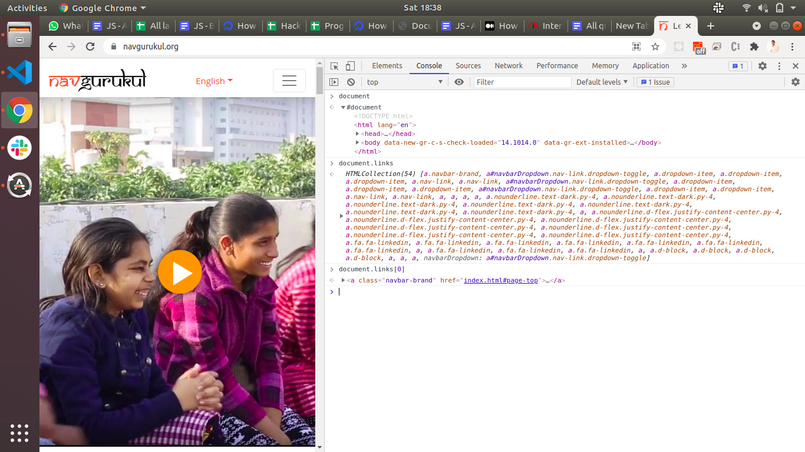

```ngMeta
name: Web Development
```

Watch this video to understand how to use what we need to install.

@[youtube](cvvwkgp4HBg&)

For running the javascript we don’t need the npm also, it will run on your web browser,

Open your browser and click ctrl+shift+i or else right click on the page and select inspect and you will get a pop up on the left side. There you can see the console, there we will get the space to write the script of JS.

Get knowledge of DOM structure.

@[youtube](_GxpmQ54aqg)



### Some basic information:

Every page which is coming on a web browser can be considered an object. When a web page is loaded, the browser creates a Document Object Model of the page.


document is an owner of all other objects in the webpage. A Document object represents the HTML document that is displayed in that window. The Document object has various properties that refer to other objects which allow access to and modification of document content.





In the console if we are writing a document word, it will give you the whole html content of the opened website you can see in the above picture.

So if you understand the document, the document is the owner of the page. So if you want to find links from that document you can easily do so by writing...

document.links



Document.links will give the list of links that are there in the whole website.

Document.links[0] will give you the first link that is there in the list.



