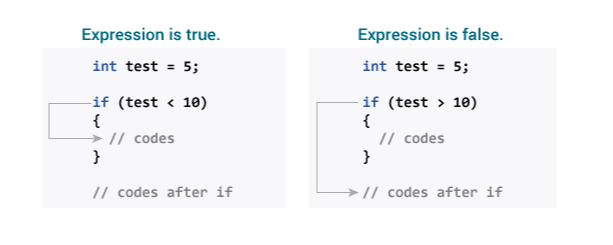
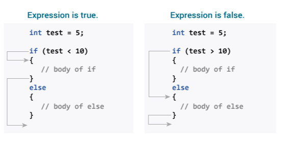

```ngMeta
name: Controll Statement
completionMethod: manual
```
<h1 style="text-align: center;">Java if-else</h1>
Java if statement hum koi condition check karne ke liye use karte hai aur ye hmesha boolean condition check karta hai :

```
True //or False
```
<h5>There are various types of if statement in java : </h5>
	<li>if statement</li>
	<li>if-else statement</li>
	<li>if-else-if ladder</li>
	<li>nested if statement</li>

Chaliye hum in 3 statement ke bre me thoda detail me jante hai
<h3>if Statement</h3>



`
Example: Java if Statement
`
```java
class IfStatement {
    public static void main(String[] args) {

    	int number = 10;

    	if (number > 0) {
    		System.out.println("Number is positive.");
    	}
    	System.out.println("This statement is always executed.");
    }
}
```
<h3>if-else Statement</h3>


`
Example: Java if-else Statement
`
```java
class IfElse {
   public static void main(String[] args) {    	
      int number = 10;
	 
      if (number > 0) {
         System.out.println("Number is positive.");
      }
      else {
         System.out.println("Number is not positive.");
      }
 
      System.out.println("This statement is always executed.");
   }
}
```
<h3>if-else-if Statement</h3>

`
Example: Java if-else-if Statement
`

```java
class Ladder {
   public static void main(String[] args) {   

      int number = 0;
	 
      if (number > 0) {
         System.out.println("Number is positive.");
      }
      else if (number < 0) {
         System.out.println("Number is negative.");
      }
      else {
         System.out.println("Number is 0.");
      } 
   }
}
```
<h3>Nested if Statement</h3>

`
Example: Nested if...else Statement
`
```java
class Number {
    public static void main(String[] args) {

        Double n1 = -1.0, n2 = 4.5, n3 = -5.3, largestNumber;

        if (n1 >= n2) {
            if (n1 >= n3) {
                largestNumber = n1;
            } else {
                largestNumber = n3;
            }
        } else {
            if (n2 >= n3) {
                largestNumber = n2;
            } else {
                largestNumber = n3;
            }
        }

        System.out.println("Largest number is " + largestNumber);
    }
}
```
For more Information Click <a href="https://www.programiz.com/java-programming/if-else-statement">Here</a>


