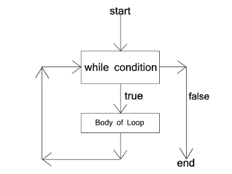

```ngMeta
name: Java for Loops
completionMethod: manual
```
`
Ek hi statement ko bar-bar repeat karna 'Looping hota hai'
`

Java mein 3 type ke loop work karte hai
1. While loop
2. do_while Loop
3. for Loop

Chaliye hum in 3 loop ke bre me atchay se jante hai example ke sath aur app in example ko apne computer mein run karke dekhengay aur atchay se understand krengay

<h5>While loop</h5>
While loop jab tak condition true nahi ho jata tab tak loop repeat hota rehta hai. Agar condition false hota hai to tak loop exit ho jata hai.



`Syntax for while Loop`
```java
variable_initialization;

while( condition ){
	//statement(s);
increment/decrement;
}
```
`Example aur app isko apne computer me run karengay aur atchay se understand krengay`
```java
//WhileLoop.java
public class WhileLoop{

    public static void main(String args[]) {

	int i = 0;
	
	while(i < 10){
		
		System.out.println("Value of i is " + i);
		i++;
	}
	}
}
```
