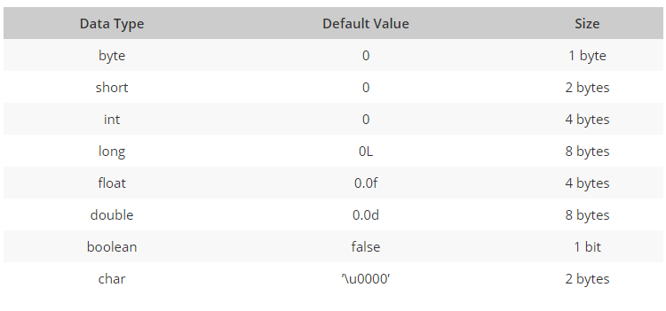

```ngMeta
name: Java Data Types
```
<h2>What is Data types?</h2>
Data types ek keywords hai. Variable kay values ko store karne kay liye alag-alag data types banaya jata hai.

Data Types 2 types ke hote hai : 
1. Primitive Data Types (Basic)
2. Non-primitive Data Types

<h4>Primitive Data types 8 types ke hote hai : </h4> 


<center>Click here for know more details about each data types : <a href="#">Here</a></center><br>

<h4>Non-primitive Data types 2 type ke hote hai : </h4>

1. Strings
2. Arrays
