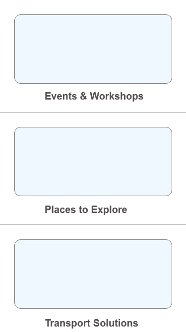

```ngMeta
name: Understanding Layouts
```

### Iss layout mei 3 cards hai. Pehle inn cards ko ek Android mei XML layout use kar kar banao.

 

### Kisi bhi card par click karne par yeh wala layout open hoga.

 