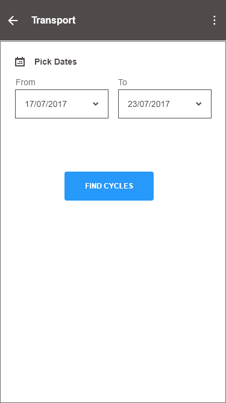
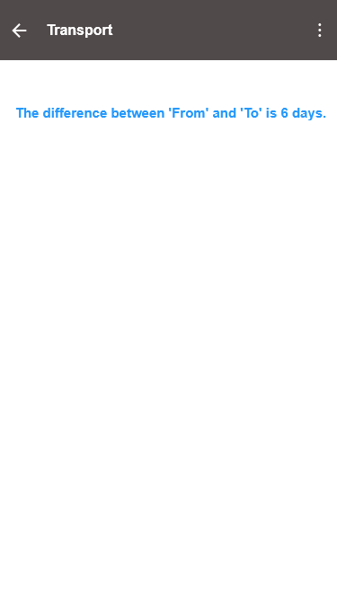

```ngMeta
name: Understanding Layouts 2
```


### Aap pehle layout me 3 cards bnaye the jisme 3rd card Transport Solutions tha. usper click krne pr jo layout open hoga uski designing kuchh es trah hogi Jisme 2 dates pick krne ke options honge or ek button hoga jisper click krne pr niche ka layout open hoga. Ese XML ka use krke bnao. 

 


### Upper wale layout me ek button hai. jb usper click kroge to ye wala layout open hoga. es layout me aap dono dates ke bich ke difference ko days me calculate krke show kroge. 


