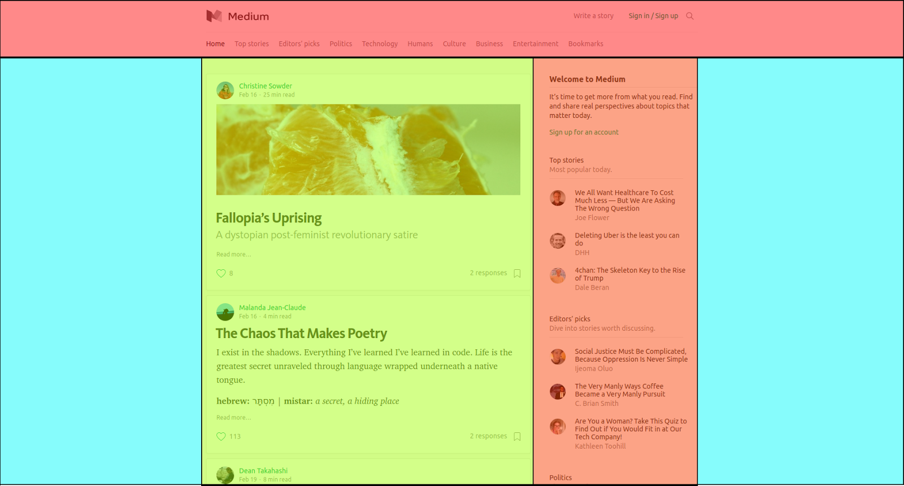
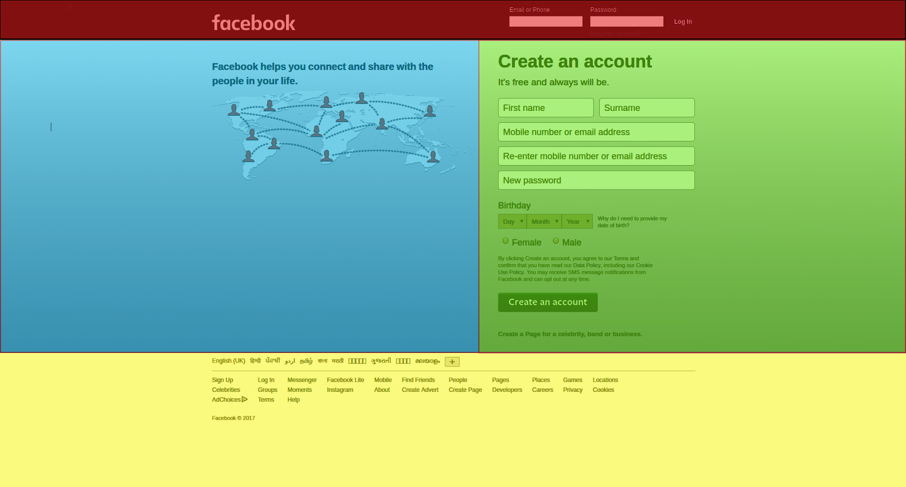

```ngMeta
name: Introduction to Flex
completionMethod: manual
```

# Introduction to flex

Page ka layout banane ke liye hum **display flex** ka use karte hai. Hum alag-alag tarah ke layout bana sakte hai. Jaise neeche di gayi images mein colored boxes flex items hai.




Ab hum flex ko use karna seekhenge. Flex mein 2 cheezein bahut important hoti hai. Yeh naam baar baar aayenge, toh inhe acche se samajh le:

1. **Items**  
   Jin HTML tags ka humein layout banana hai unko hum items bolte hai. Items ko flex mei hum kuch properties de sakte hai jaise - **align-self, flex-grow, flex-basis,** etc.
      
2. **Container**  
   Items kisi container ke andar hote hai, aur ussi container ke hisaab se items ka layout banta hai.

   Agar container ki width 200px hai, toh items bhi usi 200px jagah mei arrange honge. Hum **display:flex** property ka use karke, batate hai ki kaunsa tag container hai. Container mei **justify-content, align-items,** **flex-wrap, flex-direction,** etc. jaisi properties hoti hai.