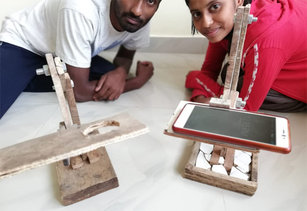

```ngMeta
name: Hackathon - Dry Run
completionMethod: manual
```

## Hackathon
### Dry Run on a Dry Day

Iss hackathon mei hum log **dry run** kar kar, hum **computer** ki tarah sochna seekhenge.

<!-- Dry Run kaise karte hai, aap yeh video dekh kar sikein. -->

Dry Run karne ke liye aap sab log ek doosre ki help lenge. Aap mei se kuch logo ko accha se karna aata hai, kuch ko kam acche se.

Dry Run bahut **dheere dheere** karna hoga, jisse koi galti nahi hogi. Kuch programs **galat** honge toh aap ko yeh dekhna hoga, ki woh kaha par galat hai.

Dhyaan rakhein ki - __galat program ka bhi dry run kiya jaa sakta hai__. Jaise hum agar **galat code** likhte hai, phir bhi computer usse samajh kar error throw karta hai, waise bhi unn cases mei humein woh **error throw** karni padegi aur batana hoga, ki woh program galat hai.

### Ek Twist
Aapko hackathons mei 30 problems solve karni hai, saath saaath, aapko at least 5 videos each bhi create kar kar **youtube** par upload karni hai. Videos can explain dry run kya hota hai, ya phir kisi bhi problem ki **solution video** ho sakti hai.

**Solution video**, ek aisi video hoti hai, jo har ek problem statement ke liye banayi jaati hai, jisse dekh kar koi aur reader samajh sakta hai ki uss question ko kaise solve kiya jaata hai. Aapko inn videos mei detail mei dry run karna hoga, aur acche se samjhana hoga ki aapne jo kiya hai woh kyu kiya hai.


<br>
<br>
<br>
<p align="center">Video record karne ke liye, hum yeh <b>stand</b> use karenge.</p>



<!-- TODO: CREATE WRONG VIDEOS AND ASK STUDENTS TO IDENTIFY THE ERROR -->