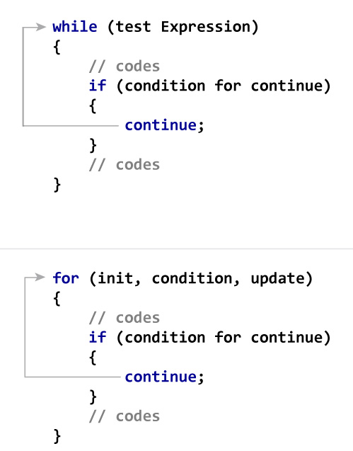

```ngMeta
name: Using Continue
completionMethod: manual
```

Aap pehle [iss video](https://www.youtube.com/watch?v=rOfNF7gj5t0&feature=youtu.be) ko dekhein `continue` command ka loop mei kaam samajhne ke liye. Iss understanding ko use kar kar, humein aage likhe hue code ka dry run karna hai.

```python
counter = 0
string = "navgurukul"
while (counter < len(string)):
    counter += 1

    if string[counter] == "a":
        continue

    if string[counter] == "u"
        continue
    
    print(string[counter])

print("The end", string[counter])
```



Agar aap yeh diagram dekhoge toh aap samjhoge, ki `continue` command se hum loop mei
- jo bhi `continue` ke baad code hai uss loop mei, woh `execute` nahi hota
- loop ki starting mei `control flow` pahuch jaata hai

Ab iss idea ko use karte hue in example codes ka `dry run` karein.

__Ek baar dhyaan se dekhein ki break aur continue mei kya difference hai__

```python
x = 0
while(x<7):
    if (x == 3 or x==5):
        x = x + 1
        continue
    print(x)
    x = x + 1
```

```python
x = 10
while(x<20):
    if (x == 15):
        break
    if (x % 2 == 0):
        x = x + 1
        continue
    print x
    x = x + 1
```

```python
num = 2
while(num < 10):
    if num % 2 == 0:
        print "Found an even number", num
        num = num + 1
        continue
    print "Found a number", num
    num = num + 1
```
Iss program ko `execute` karo. Iss program ko bina `continue` statement ke dobara likho.