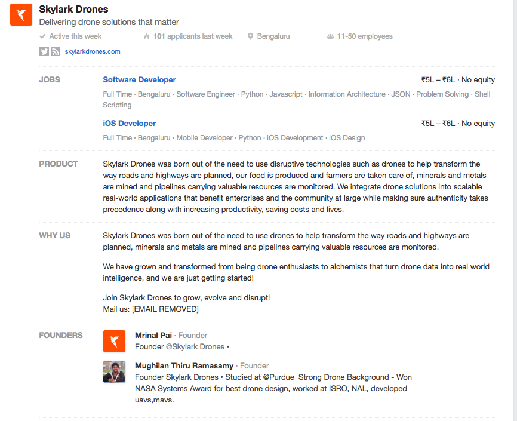
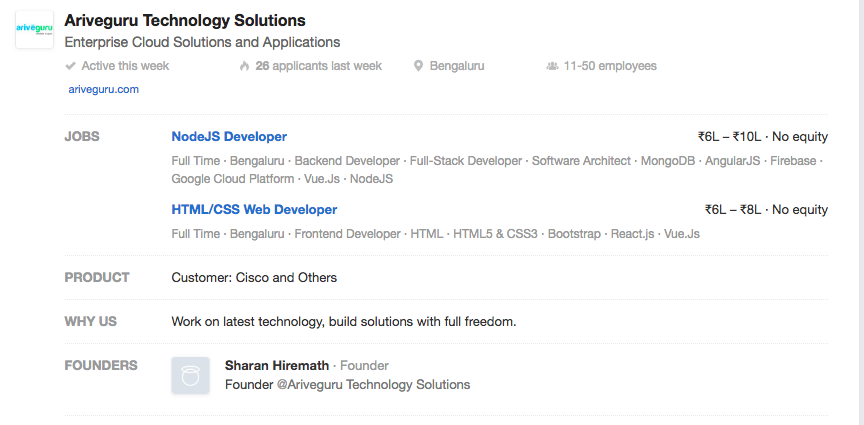
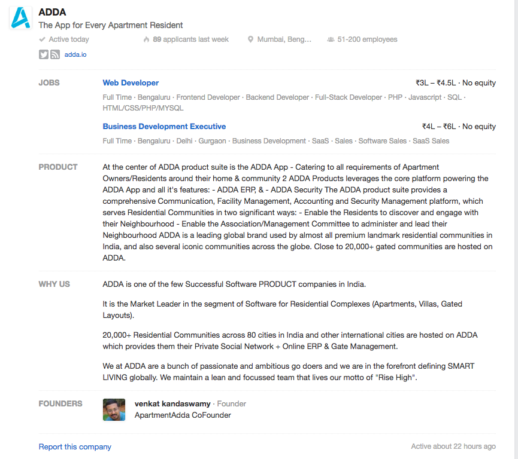
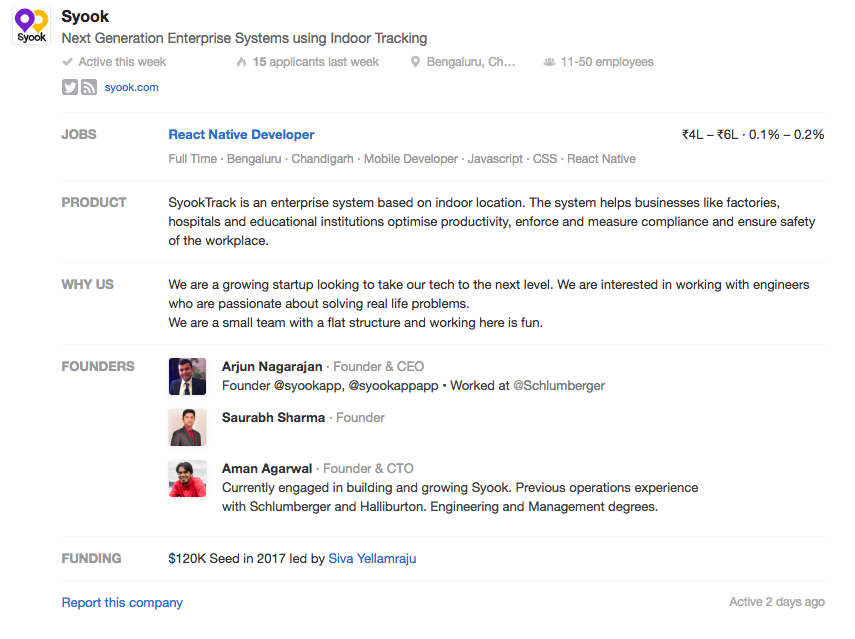
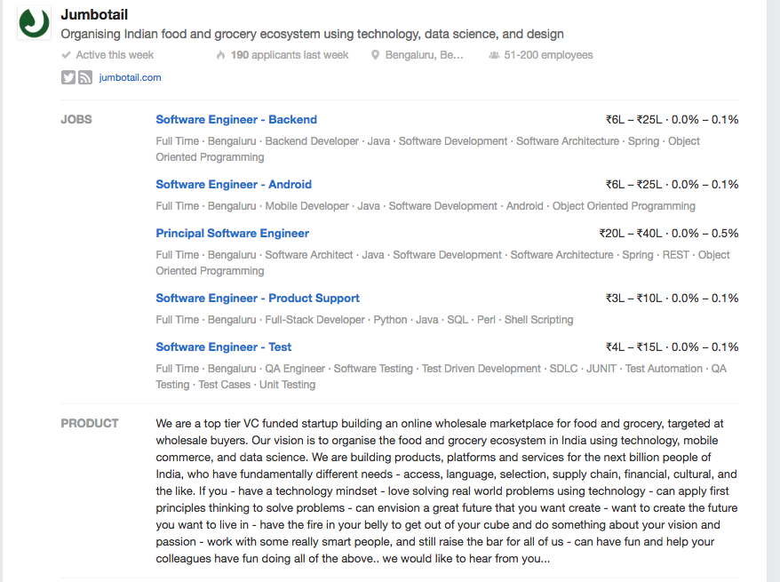

```ngMeta
name: Exercise - Job Applications
```

Neeche kuch job descriptions diye gae hain. Aapko in job descriptions ke liye apply karte hue ek email compose karna hai. 

Email compose karte waqt neeche di gai cheezon ka dhyan rakhein:
1. Sabse pehle job ki requirements aur description ko achhi tarah se padhein aur samjhein. 
2. Company ke baare mein jo details di gai hain, unko achhi tarah se samjhein.
3. Email me subject line, greeting, introduction, closing, etc. saare parts ko achhe se likhein.

Job One
<br>

Job Two
<br>

Job Three
<br>

Job Four
<br>

Job Five
<br>



