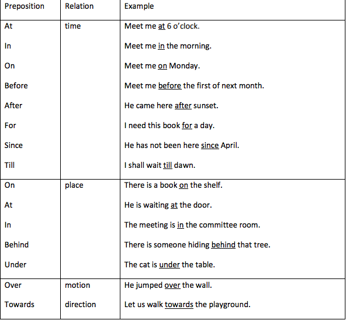
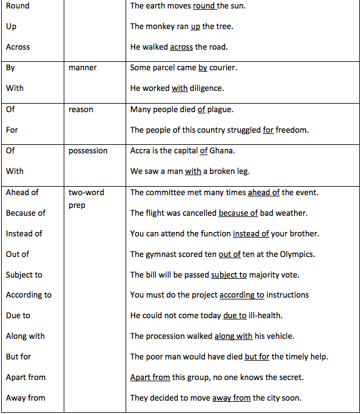

```ngMeta
submissionType
```

Preposition: is a word which joins a noun or pronoun to a sentence or another word to show relationship. (Pre=before; position=place)

Example:

* There is no water **in** the well. (relationship with ‘there is no water’ and ‘well’)
* He will leave **by** tomorrow’s train. (relationship of ‘leave’ [verb] with ‘train’ [noun])
* We are proud **of** you. (relationship of ‘proud’ [adjective] with ‘you’ [pronoun])

@[youtube](FdBDtbNcd-8)

@[youtube](XYBnvCphgtw)

@[youtube](R2YrX4-pSR8)







Exercise:
1. Rekha was born __________ 1999.
2. She grew up ________ Orissa.
3. She went _________ America when she was older.
4. She wrote five collections ________ poetry.
5. MeToo movement is related _______ sexual harrasment.
6. Many students go ________ higher studies ______ other cities.
7. Like many youngsters, he is not comfortable _____ English. 

Exercise 2: 

Make sentences using the following prepositions.

on, at, in, before, after, for, since, under, with, behind

Exercise 3: 

Correct the following:

1. Beside winning independence, the people also got a new identity.
2. This land is situated among the desert and the grassland.
3. The treasure was kept into a hiding place.
4. Arun cut his hand by a knife.
5. The student did not come to class since many days.
6. This is a comfortable house to live.
7. The workers asked a holiday
8. We pray God everyday.
9. My house is superior than yours.
10. This question is different to the earlier one.
11. You can call him with his first name.
12. The application should be filled with ink.
13. The elders need to discuss about the matter.
14. The guest was given a chair to sit.
15. We are searching a book in the library.
