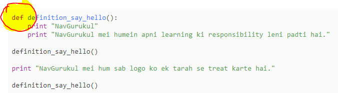
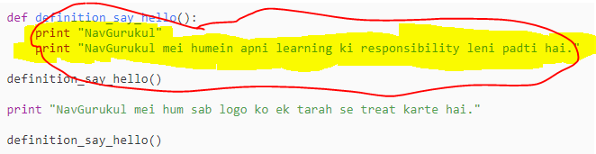
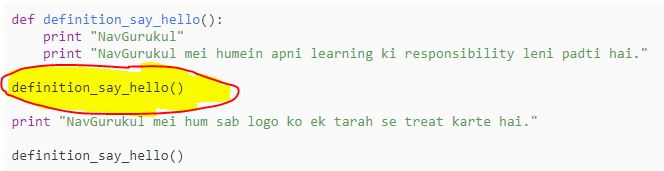
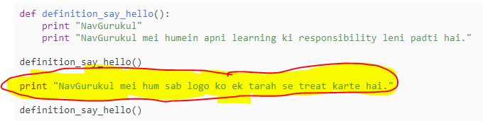
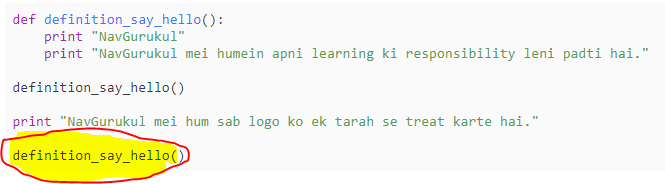

```ngMeta
name: Functions
```

# Basics of Functions

Function ek block of code hota hai jo ki run hota hai jab hum use call karte hai. Function mei hum data pass kar sekhte hai jise hum parameter kahete hai. Function data return karta hai. Functions ka use kar ke hum ek baar kuch code likh kar usko bahot baar use kar sakte hai. Isse humara kaam bahot aasan ho jata hai.


```python
print ("NavGurukul")

def say_hello():
    print ("Hello!")
    print ("Aap kaise ho?")

say_hello()
print ("Python is awesome")
say_hello()
print ("Hello…")
say_hello()
```

Isko chala ke dekho. Iski output kuch aisi aayegi:

```
NavGurukul
Hello!
Aap kaise ho?
Python is awesome
Hello!
Aap kaise ho?
Hello…
Hello!
Aap kaise ho?
```

Dhayn se dekho ki code mein jahan bhi `say_hello()` likha hai, wahan `Hello!` aur `Aap kaise ho?` waali lines print ho gayi hain. Yeh isliye hua hai kyunki humne ek baar doosri line mein `def say_hello()` ka use kar ke ek function likh diya. Ab jab bhi yeh function call hoga toh iske andar waala code chal jayega. Iss tareeke se hum baar baar ek code ko user kar sakte hain.

## Introduction to Functions

Functions ka use karke hum kuch code ek baar likh ke usse baar baar wahi kaam karva sakte hain. Aap abhi tak bahot functions ka use kar chuke ho. Iss code ko padho:

```python
names_list = ["Fiza", "Shivam", "Imtiyaz", "Deepanshu", "Rahman"]
print (len(names_list))
```

`Ouput:-`

`5`

Yahan `len(names_list)` ka use kar ke humne jana ki list mein kitne item hai. Ab hum apne code mein `len` ka use kar kisi bhi list ke items ki ginti kar sakte hain. Yahan `len` ek function hai. Functions ke bina humein list ki items ki ginti nikalne ke liye baar baar code likhna padega. Isko behtar samajhne hum aage wale examples mein iska code khud likhenge.

Hum ek function likhenge. Iss code ko pehle chala ke dekho, aur fir neeche padiye iske baare mein samajhne ke liye.

```python
def definition_say_hello():
    print ("NavGurukul")
    print ("NavGurukul mei humein apni learning ki responsibility leni padti hai.")

definition_say_hello()

print ("NavGurukul mei hum sab logo ko ek tarah se treat karte hai.")

definition_say_hello()
```
`Output:- `

```
NavGurukul

NavGurukul mei humein apni learning ki responsibility leni padti hai.

NavGurukul mei hum sab logo ko ek tarah se treat karte hai.

NavGurukul

NavGurukul mei humein apni learning ki responsibility leni padti hai.
 ```

Ek aur example FUNCTIONS samajhne ke liye. Iss code ko padh ke output socho. Chala ke dekhne ke baad dhyan se padho.

1. Shuruat mein `def` ka use kar ke hum python ko bata rahe ki humne ek `definition_say_hello` naam ka function likha hai.

2. Iss function ka code (do print karne ki lines) kuch indent (space) deke `def definition_say_hello()` ke neeche likha hua hai. Inn spaces se python samajh jata hai ki yeh function ka code hai.

3. Fir agli line, `definition_say_hello()` mein humne function ko bulaya hai jisse function ke andar wala code chal jata hai. Isko **FUNCTION CALL** karna kehte hain.

4. Iske baad print statement use kar ke humne ek string print kiya hai.

5. Aakhir mein humne firse `definition_say_hello()` likh ke function call ki hai. Ek aur baar function ek baar andar wale code ko chala deti hai. Isse andar waali jo function ke andar code hai - yaani - *2 print* command chal jati hai.



```python
def function_say_bye():
    print ("Aapko mil ke maza aaya. ")
    print ("Bye bye")
function_say_bye()
function_say_bye()
print ("Python ka istamaal bahot jagah hota hai.")
function_say_bye()
function_say_bye()
```

1. Hum python mein `def` keyword ka use kar ke function banate hain. `def` ke baad function ka naam, `function_say_bye` likha hain. Naam ke baad hum do bracket `(` `)` lagate hain.
2. Bracket ke baad ek colon, `:` lagate hain. Python semicolon se samajh jaati hai ki function ka code shuru ho raha hai.
3. Dekhiye ki sara function ka code indent (space) deke likha hua hai. Isse python ko samajh aata hai ki yeh function ke andar ka code hai.
4. `print ("Bye bye")` ke baad code space diye bina likha hua hai. Isse python ko samajh aati hai ki function ka code kahatam ho gaya hai
5. functions ko bhi variables ko naam dene ke rules ke hisaab se hi naam dete hain. yaad rakhne ke liye ek baar variables ko naam dene ke rules yaad rakh li jiye.

## Function Call ko samajhna

Neeche diye gaye code ko likhiye aur dekhiye ki iska koi output aa raha hai ya nahi. Nahi aa raha toh kyun nahi aa rahi?

```python
def definition_hello_again():
    print ("Firse Hello :)")
    print ("Aap kaise ho?")
```

Ab apne code mein yeh line add karein aur dekhein ki koi output aati hai.

```python
definition_hello_again()
```

Python mein sirf function likh dene se function ka code chalta nahi hai. Yahan pehle humne def keyword ka use karke python ko function ka code bataya. Isko **"FUNCTION DEFINITION"** kehte hain.

Fir humne baad mein `definition_hello_again()` likh ke function ko bulaya aur usme likha hua code chalwaya. Isko **"FUNCTION CALL"** karna kehte hain. **"FUNCTION CALL"** mein hum function ke naam ke baad 2 bracket `(` `)` lagate hain. Isse python ko pata chalta hai ki function ke andar ka code chalana hai.

@[youtube](https://www.youtube.com/watch?v=WkC7ktXM_8k)

@[youtube](https://youtu.be/AJJpGImQWLc)
