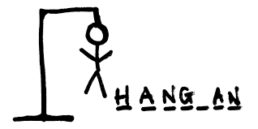

Iss project mei hum log `hangman` game develop karenge. 

Game ko samajhne ke liye aap [yaha](https://hangmanwordgame.com) par ja kar iss game ko khel sakte hai. Bahut simple sa game hai

- Computer ek word sochta hai
- Jitne uss words mei characters hote hai, utne letters ke jagah computer `_` show karta hai
- User koi letter guess karta hai
- Agar woh letter uss word mei hota hai, toh computer aapko woh word mei uss jagah `_` replace kar kar, woh letters show karta hai
- Aisa chalta rehta hai, jab tak aap word ko sahi se guess nahi kar paatein

Game mei aur bhi bahut saari cheezein ki jaa sakti hai
- **Hint**
User ek baar hint maang sakta hai, aur computer user ko ek letter reveal kar sakta hai

- **Limited Lives**
User ko kuch hi lives do, agar woh lives khatam ho jaye, toh "Game Over" dikhao

- **Animation ya Design**
Aap game ko improve karne ke liye animations ya design add kar sakte hai

Aap apne bhi ideas soch kar implement kar sakte hai.
Chalo baatein bahut hui, ab code karna shuru karte hai :-)