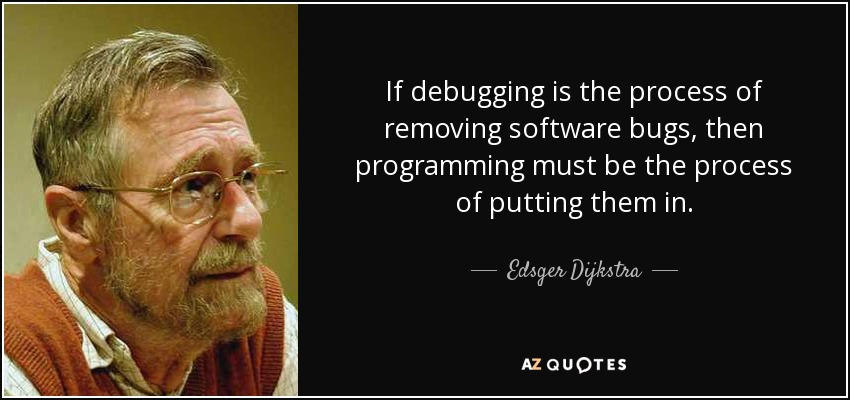

```ngMeta
name: Debugging
```

## What is `debugging` ?




We have learned how to write a code. When we write a code, many times the code does not run because of our mistakes. Sometimes we need to work with code written by someone else. In such cases, we might need to correct the mistakes within the code. This process is called `debugging`. Try to run the code given below:

```python
	number1 = 234
	print(numer1)
```

When we try to run the code, we see some error message as below:

```python
<ipython-input-1-2a33fa4e8a92> in <module>()
      1 number1 = 234
----> 2 print(numer1)

NameError: name 'numer1' is not defined
```

This is an error message indicating that there is some error on line 2 (pointed by arrow). In the end, we can see the name and description of the error. In the above example, we see the name of the error as `NameError` with the description that `name 'numer1' is not defined`. 

By looking at this error message, we can conclude that `numer1` variable is not defined. That means we haven't created a variable named `numer1`. If you observe carefully, there is a spelling mistake in the program. We have missed the letter `b` in the variable name `number1` and have written `numer1` by mistake.

Once this is corrected, the program will run.

### More problems

Try to find out the error from the below program.

```python
number1 = 234
number2 = "1"
print(number1 + number2)
```

Python will show the following error:

```python
<ipython-input-2-56b79ffda8bc> in <module>()
      1 cnumber1 = 234
      2 number2 = "1"
----> 3 print(number1 + number2)

TypeError: unsupported operand type(s) for +: 'int' and 'str'
```

This indicates that there is an error on line number 3. You can search the error message on Google to find solutions for fixing the error. If you type `TypeError: unsupported operand type(s) for +: 'int' and 'str'` in Google Search, you'll be able to find the solution from the first few links.

In the next few questions, you'll get a pre-written code. You have to `debug` the incorrect program and submit the correct file.
