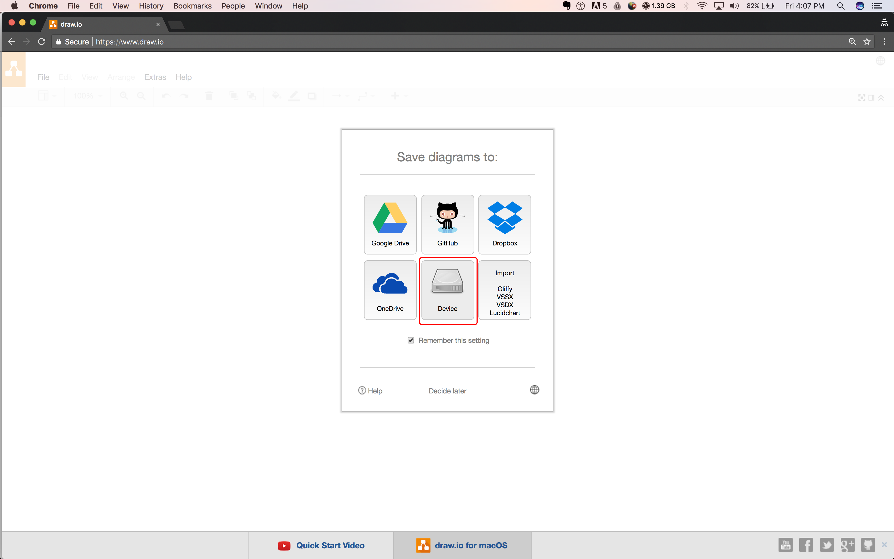
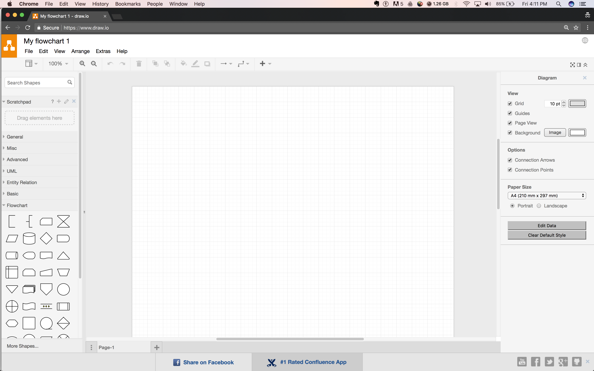

```ngMeta
name: How to make flowcharts?
```

## How to Make `Flowcharts`?

We should create `flowcharts` on paper as it is very easy and simple. Creating `flowcharts` on your laptop or computer is a little bit difficult.

However if you need to submit your flowchart, it is recommended to use [draw.io](http://draw.io) to create `flowcharts` using your laptop or computer.

### How to create flowcharts using `Draw.io`?

As soon as you open [draw.io](http://draw.io), you will be asked to choose where you want to save your flowcharts. Choose **Device** so that you can download the file to your computer.



1. Click on **Create New Diagram**.
2. Enter the name of your `flowchart`.

On the left side, you will see a flowchart section where you can find all the flowchart components to create your diagram. You can connect these boxes using arrows. 



Finally go to **File** menu to save the flowchart. When you save it, a `.xml` file will be downloaded that you can submit.

These flowchart files can be shared with one other. If you want to open an existing flowchart file from your computer, go to **File > Open From > Device** and select the file you wish to open.

### Note :-
 In the upcoming questions, you will have to create and submit flowchart files. You don't need to worry about the colors used in the flowchart on draw.io. We have colored the `flowchart` in the examples only to make it easier for you to understand.