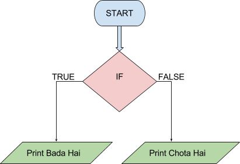

```ngMeta
name: If Statement Question 1
submission_type: url
```

**In the next few questions, complete the flowchart based on the instructions given. Do not focus on the colors of the flowchart.**

Check whether 100 is greater than 99? If yes, print **"Bada hai"**, else print **"Chota hai"**. Complete the if statement in this question.



You will need to create this entire flowchart in draw.io and upload the final file here.


