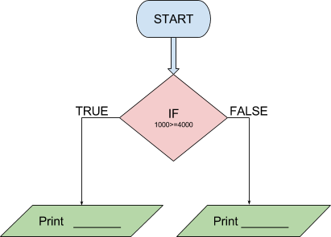

```ngMeta
name: If Statement Question 2
submission_type: url
```

## Question 2

Check whether 1000 is **greater than or equal** to `4000`. If yes, print **"barabar ya bada hai"**. Else print **"nahi hai"**. Complete the `print` statements in this question. 


