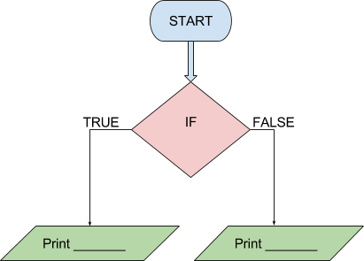

```ngMeta
name: If Statement Question 3
submission_type: url
```
## Question 3

Check whether `1000` is equal to `1000`. If yes, print **"barabar hai"**, else print **"barabar nahi hai"**. Complete the if statement as well as the `print` statements in this question.


