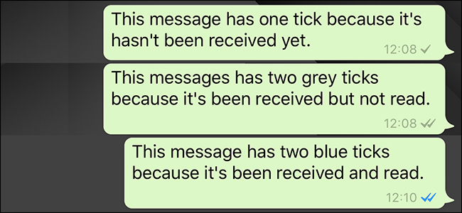

```ngMeta
name: If Statements
```

## `Programming & If Statements`

By learning programming, we can make the computer do anything that we want. For example, we can write a program that shows the food menu for each day. We can use conditions to display the food item depending on what day it is.

#### Example :-

1. On Monday, "Rajma Chawal" will be made.
2. On Tuesday, "Mutton Kosha" will be made.
3. On Wednesday, "Pizza" will be made.
4. On Thursday, "Dal - Roti" will be made.

To do this in `programming`, we use `if statements`. You can observe the applications of `if statements` in your daily life around you. For example, *Whatsapp* shows two `grey ticks` when the message is not yet read by the receiver and shows `blue ticks` when the message is read.



Watch following video for more clarity
@[youtube](https://www.youtube.com/watch?v=fVUL-vzrIcM)


## `Flowcharts`

Before writing the code, we make `flowchart`. This is done so that we understand how the program will work at each step.

Let's take an example that we want to check whether 4 is greater than 5. If yes, then we print **"bada hai"**. Else, we print **"chota hai"**. For this example, we can create the flowchart shown below:


To read a flowchart, move from the top to the bottom in the direction of the arrows. Whenever an if statement occurs, check what the output of the condition will be. If it will be `True`, then move to the path indiciated by the arrow labelled "True", else follow the other path labelled "False".

Flowchart is made up from two words

1. `Flow`
2. `Chart`

Flowchart simply indicates the direction in which the program will run. In the next few sections, we will learn how to create flowcharts. Once we are able to create the flowcharts, writing code will become much easier.

## Components of Flowchart

All the flowcharts are made up of these components:

| **Name**        	| **Image**                                                                	| **What is it?**                                                                                                                                               	|
|-----------------	|--------------------------------------------------------------------------	|---------------------------------------------------------------------------------------------------------------------------------------------------------------	|
| Process / Input 	|        	| Any output (print statement), user input or process in the program can be represented using this box.                                                                              	|
| Start           	|  	| This component indicates the start of the flowchart.	|
| Condition       	|       	| Any condition can be represented using this shape. Since an if statement can have only two outputs (`True` or `False`), two arrows go out from this shape. 	|
| Arrow           	|        	| Arrows are used to indicate the flow of the program at every step.|

### Another example of a `Flowchart`

The flowchart below shows the process of `Facebook login`. Follow the flowchart carefully, this example will clarify how flowchart works. 

