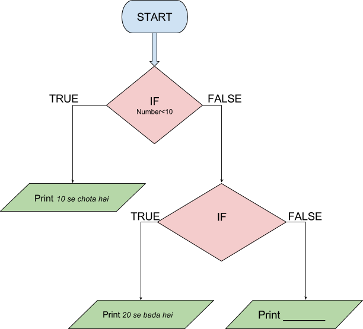

```ngMeta
name: Question 1
submission_type: url
```

In a variable named `number`, take the input from the user and convert it to `int`.

If this number is less than 10 then print  **"10 se chota hai"**. If is greater than 10 and lesser than 20 then print **"20 se chota hai"**. Else if it is greater than 20 then print **"20 se bada hai"**. Complete the flowchart as per the above instructions.



Once the flowchart is complete, write the Python program and save it as `.py` file. Submit both the files together.

*Note: In the next exercises, submit the flowchart file as well as python file.*
