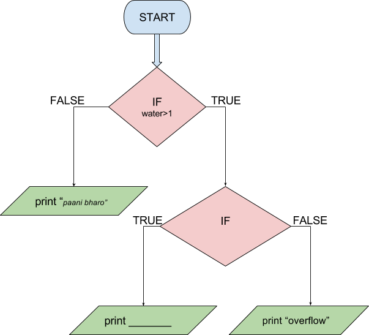

```ngMeta
name: Question 4
submission_type: url
```

If water in the filter is less than 1L then more water needs to be filled. If the water quantity is between 1L and 10L then there is no need to fill water. If water is more than 10L then the water will overflow. Based on these conditions, complete the flowchart given below.

For water level, take user input in a variable named `water` and convert it to an integer.



Complete and submit both the flowchart and the code.
