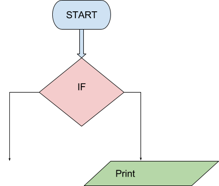

```ngMeta
name: Question 5
submission_type: url
```	

1. Take user input in a variable named `varx`.
2. Convert it to an integer.
3. Check if this number is divisible by 2.

You can achieve this by using the `modulus operator`. Remember, modulus operator returns the remainder of the division of first operand by the second operand. Example:

1. `6 % 2` returns 0 as the output because 2 completely divides 6 and the remainder is 0.
2. But `9 % 2` returns 1 as the output since 2 does not completely divide 9. The remainder is 1.

To conclude, `6` is divisible by `2` but `9` is not divisible by `2`.

If the number is divisible by 2, print `Divisible` else print `Not Divisible`



Create the flowchart and code and submit both of them.
