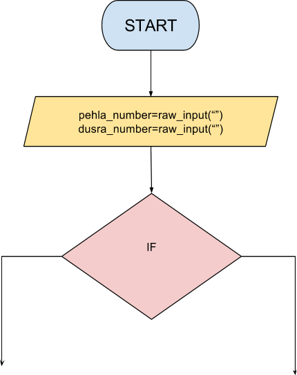

```ngMeta
name: Question 7
submission_type: url
```
## Question 7
Create a flowchart to take two numbers as input from the user. Print the number which is greater.



For example, if user enters **100** and **30**, then print **100** as it is greater.

Submit the flowchart and code for this question.
