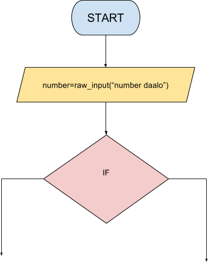

```ngMeta
name: Question 8
submission_type: url
```
## Question 6

Create a flowchart that takes a `number` as user input. Check if this number is divisible by **5 and 15 both**.



*Hint: You will need to use nested if-else for this question.*

Submit flowchart as well as code.
