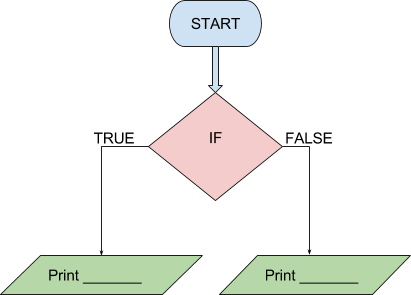

```ngMeta
name: Kaise shuru karein?
submission_type: url
```

Check karo ki kya 1000 1000 ke barabar hai? Agar hai to print karo "barabar hai", aur nahi to print karo "barabar nahi hai". Isme aapko print aur if dono likhne hai.


