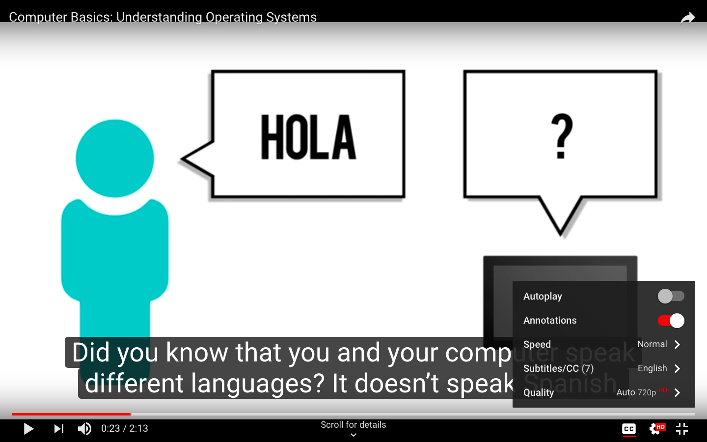

Here are some of the tools that can make your learning easier. Using all of these tools and extensions is highly recommended for everyone.

1. [Grammarly](https://chrome.google.com/webstore/detail/grammarly-for-chrome/kbfnbcaeplbcioakkpcpgfkobkghlhen?hl=en): Grammarly helps in writing without spelling and grammatical errors.

2. [Dictionary](https://chrome.google.com/webstore/detail/google-dictionary-by-goog/mgijmajocgfcbeboacabfgobmjgjcoja?hl=en): This is a tool that helps in finding the meanings of words on a selected word on the webpage itself. 

3. Subtitles & Speed Control: Switching on subtitles when watching videos in English can help in understanding it better. Also, you can reduce the speed of the video and understand it at your pace.

4. [Toggl](https://toggl.com/): Toggl is the time tracking tool that helps you in tracking the time that you are spending in the various activities you engage in throughout the day.
5. [Cliq](https://cliq.zoho.com/): Cliq is the communications tool that is used for internal communication in NavGurukul. All students and team members are present on the platform and communications happen on personal as well as relevant group levels.
6. [Google Drive](https://www.google.com/drive/): Google Drive is used to store all data on the cloud. This ensures that the data is available to you anywhere, anytime and also that sharing is easier.

