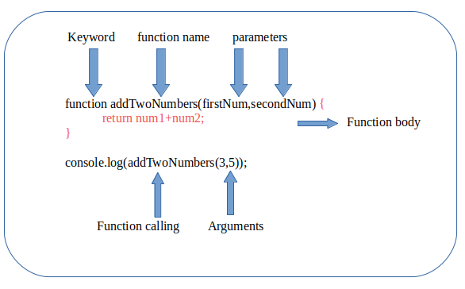

```ngMeta
name: Defining and calling a function
```

The declaration of a function starts with the function keyword, followed by the name of the function you want to create, followed by parentheses i.e. (). Function naming can follow all rules as variables.

The parentheses may include parameter names separated by commas:
(parameter1, parameter2, ...)

Finally write your function's code between curly brackets {}. Here's the basic syntax for declaring a function:





### Example:

```javascript

// Defining function

function sayHello(name) {
 return "Hello " + name
}
 
console.log(sayHello("Pragna"))
 
// Output :
// Hello pragna

```

- #### How to Call a function

Let’s look at our simple function example again

```javascript

function sayHello(name) {
 return "Hello " + name
}
// Calling function
console.log(sayHello("Pragna"))

```

Once a function is defined it can be called (invoked) from anywhere in the document, by typing its name followed by a set of parentheses, like sayHello() in the example above this is how we call a function.
 
### Explanation: 

The above code is the example of function. The js function keyword helps us to define a function. The parameter name is like a variable which will take the argument we passed to the function as a value. Return is a keyword which stores the value of a function and gives the value whenever we call the function like console.log(sayHello("Pragna")).

This code output will be Hello Pragna because we are returning Hello with name and name is having Pragna as a value.

### Exercises:

1. Write a function sayBye() which takes 1 argument like user’s name and returns 
“Bye user’s name” ?

```javascript
//please write code here
```

```solution
function sayBye(userName){
   return "Bye"+" "+userName
}
 
console.log(sayBye("Kumar"))
```

2. What is the output of the following code?

```javascript
 function getFullName(firstName,lastName){
 console.log(firstName+" "+lastName)
}
 
getFullName("kumar","nayak");
 ```

```solution
kumar nayak
```

3. What is the error in this code?

```javascript
function getFullName(firstName,lastName){
 console.log(firstName+" "+lastName)
}
 
GetFullName("kumar","nayak");
 
```
```solution
ReferenceError: GetFullName is not defined


Because Javascript is case sensitive and here x and X both are different and you defined function name as getFullName and you are calling it with 
GetFullName and they both are different.. I hope you got it now.
```