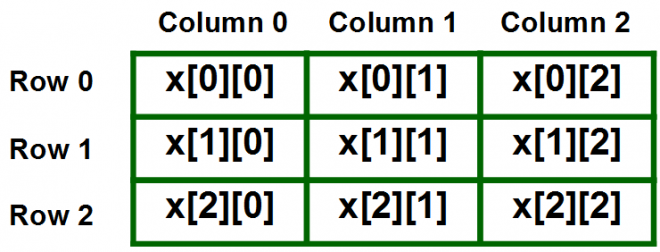

```ngMeta
name: Nested Lists
```

## LISTS within List

See this list :-

```python
magic_square = [
    [8, 3, 4],
    [1, 5, 9],
    [6, 7, 2]
]

print type(magic_square)
print type(magic_square[0])
print type(magic_square[1])

print sum(magic_square[0])
print sum(magic_square[1])
print sum(magic_square[2])
```

See this image carefully :-



to understand that how to access elements in `nested_lists`.

### Bonus Content
If you want to learn lists with a very strong depth, watch this video :

@[youtube](9rLdQP3g4fw)

