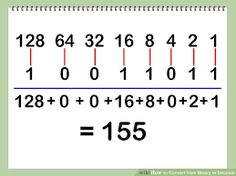

```ngMeta
submissionType: url
```

## Binary to Decimal

Iss program mei humein agar koi number **binary form** mei diya gaya hai, toh hum uski **decimal form** nikalna seekhenge.



Jaise yeh diagram dekho.

```python
binary_number = [1, 0, 0, 1, 1, 0, 1, 1]
```

Iss number ko decimal form mei karne ke liye, hum

```python
# last element ko 2^0 yaani 1 se
# second last element ko 2^1 yaani 2 se
# third last element ko 2^2 yaani 4 se
# fourth last element ko 2^3 yaani 8 se
# ...
# ...
# 
# multiply kar kar
# add karna hai
```

Aise karne se uppar wali list ka answer **155** aayega.

## Edge Case
```python
binary_number = [1, 0, 0, 2, 1]
```

Aapka program iss case mei kya output deta hai? Aapke program agar **robust** hoga, toh bolega invalid output, nahi toh error throw karega.

```python
binary_number = [1, 0, 0, "1", 1]
```

Aapka program iss case mei kya output deta hai?
Aapke program agar **robust** hoga

    - toh bolega invalid output, ya
    - "1" ko 1 ki tarah maan kar solve kar dega

Par **robust** nahi hoga, toh error throw karega.