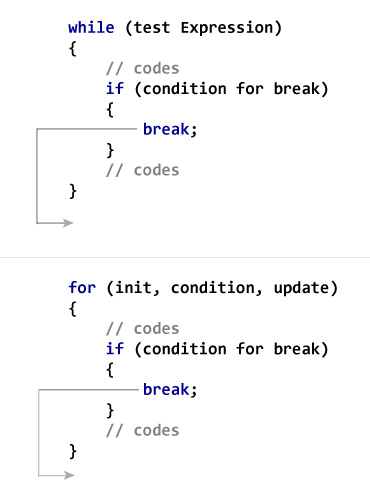

```ngMeta
name: Break Statement
submission_type: url
```

## `break`

`break` is a **keyword** in python. That helps us in coming out of the `loop` and goes to new line which is out of the `loop`.


```python
index = 0;  
while 1:  
    print(index," ",end = ""),  
    index=index+1;  
    if index == 10:  
        break;  
print("Found at",index,"location")
 ```
