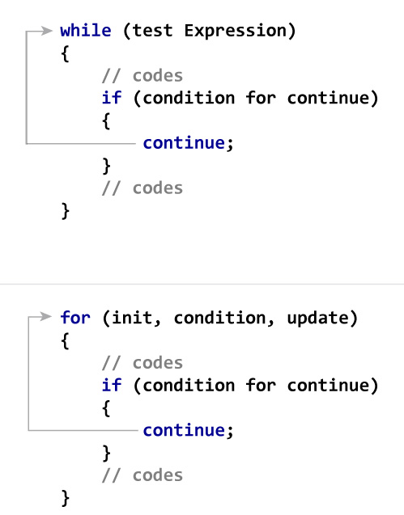

```ngMeta
name: continue
submission_type: url
```

# continue

continue ek python mai ek *keyword* hai..




```python
counter = 0
string = "navgurukul"
while (counter < len(string)):
    counter += 1

    if string[counter] == "a":
        continue

    if string[counter] == "u":
        continue
    
    print(string[counter])

print("The end", string[counter])
 ```
Iss code ko hum video ke through samjhege.

@[youtube](https://www.youtube.com/watch?v=rOfNF7gj5t0)