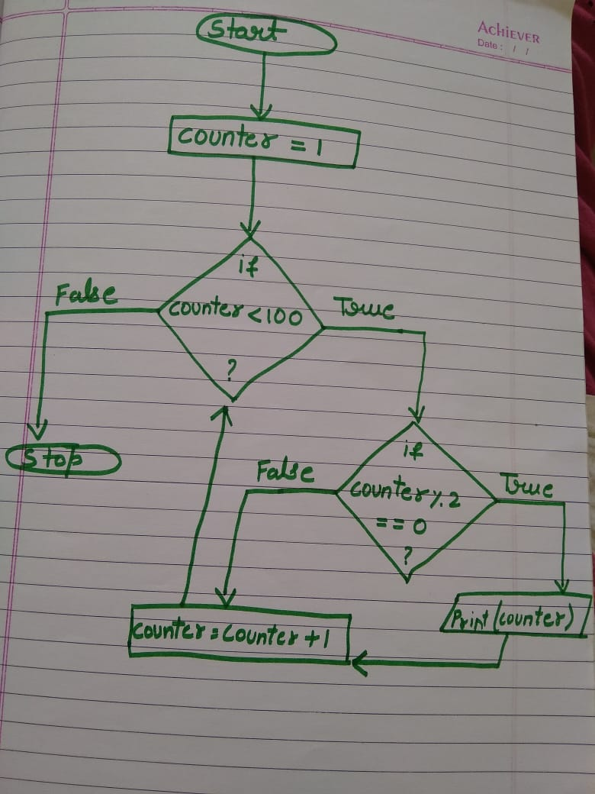

```ngMeta
name: Loop
submission_type: url
```

## What are loops?

If we want to do a task again and again, so computers can help us with that task.

@[youtube](hYvcoRkAkOU)

### Not Translated

If I want to send mail to my 100 friends to inform about certain event. If I send the mails one by one it will be a very tedious task for me and I might commit a mistake also. With the help of loops we can do this work very easily and efficiently.
 


### Writing code for loops

```python
counter = 0
while counter < 5:
	print("NavGurukul")
	counter = counter + 1
```

In this code :

1. Take a variable named as `counter` whose value is 0. Same thing is happening in the flowchart.
2. Then a `while` loop statement is written with the condition `counter < 5`. `While` statement means (till). So,`while` loop tells python that till the given condition `True`, you can run the loop.
3. When the loop finishes, the code outside the while loop will run. To understand the run the code given below.

```python
counter = 0 
while counter < 5:
	print("NavGurukul")
	counter = counter + 1
print("Yeh sirf ek baar print hoga")
```

If you run this code so`"NavGurukul"`will be printed 5 times and last line is printed one time.

### One more example

Suppose we need to write a code where we need to print the numbers divisible by 2 between 1 to 100.

```python
counter = 1
while counter < 100:
      if counter % 2 == 0:
            print(counter)
      counter = counter + 1
```


#### Note:
Here, we have taken the `counter` as 1  as we have to print from `1 to 100` and not from `0 to 99`.
 
In this video, we will understand loops and learn how to write their code.

<!-- @[youtube](loops-video-id-here) -->

<!-- ## Structure of the Video -->

1. Loops help us do the same things again and again. The same work can be done again and again.

2. Take an example of getting laptops from a car to the house. If there are 50 laptops in the car.

3. Explain this from the concept of `(till / until)`. `Until` the laptops inside the home becomes 0 `till` then take the laptops and keep them in the car. 
      - Do this work again and again.
      - But till when we will do this work? This is decided by `until`.
      - Whatever condition we put inside  `until`, `till then` the loop runs.
      - Here, under the `until` condition, we will write `laptops >= 10`.
      - Means when laptops become 10 or greater than 10 then stop doing the work.
      - What is the work inside `until`?
      The work inside until is to bring a laptop from home and keep it in the car.
      
      - The moment this work is done one time, one laptop becomes less.
      - We will write this in python.
4. Take the example of teaching this in python.
      - Let's say the total number of laptops is 10. `Laptops = 0`, this variable will maintain the number of laptops.
      - Until the number of laptops becomes 10, till then bring the laptops from the home and keep it in the car.
      -`while laptops <= 10` means this work happens 10 times.
      - Our work is to keep the laptops in the car? print( "One laptop kept in the car.")
      - Then how we will track that we have kept the laptop or done our work?
      - or that we will add +1 to laptop variable means that much laptop we kept in the car.
      - Let's do the dry run of the same program to see if this works fine.
5. Second we will write the same program in the python visualizer to see if it works the same way as we thought it would. And now explain how the visualizer would run this code.
6. Similarly take another example of printing numbers from 1 to 20.
7. Take another example of how to print the even numbers from 20 to 40.
8. In the `20 to 40` example talk about where to add the `if statements`. Adding the` if statement outside and adding the if statement inside.` (This also needs to be shown on how writing if statements inside and outside will create a difference.). `i+1 and % `should be used.
9. Take the same example to print the `even numbers` between `20 to 40`. But here do `i+2` to do it.