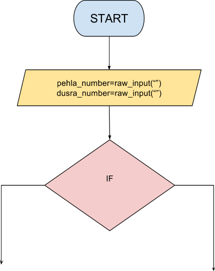

```ngMeta
name: Question 7
completionMethod: peer
```

Ek flowchart banao jo user se **2 numbers input** le. Aur dono mein se bade number ko **print** kare. 



**Jaise**, agar user **100 aur 30** input kare, tab **100 print** hona chahye.

Iska flowchart aur code, dono submit karo.