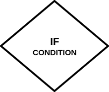

```ngMeta
name: If Statements
completionMethod: manual
```

# Programming & If Statements

Programming seekh ke hum computers ko kuch bhi karva sakte hain jo hum chaye. Jaise agar aap ek program bana rahe ho jo ki jo har din ka menu dikhata hai, usmein aap aisi condition laga sakte hain jo din ke hisaab se menu dikhana.

Jaise:

1. Monday hai toh "Rajma Chawal" banenge.
2. Tuesday hai toh "Mutton Kosha" banega.
3. Wednesday hai toh "Pizza" banega
4. Thursday hai toh "Dal - Roti" banegi

Programming mein yeh karne ke liye hum if statements ka use karte hain. Aap apne aas paas aisi bahot saari if statements ka use dekhte hoge. Jaise, `WhatsApp` message padh lene par `Blue Tick` dikhata hai aur nahi pade jane par `Grey Tick` dikhata hai.


# Flowcharts

Hum apne programs ka code likhne se pehle, flowchart banate hai. Aise isliye karte hai taaki hum yeh samajh paaye ki program her step per kaise chalega.

Jaise, agar aapko yeh check karna hai ki kya 4 5 se bada hai? Agar bada hai to print karo **"bada hai"**. Aur agar nahi hai to print karo **"chota hai"**. Iska hum aise flowchart bana sakte hai:


Flowcharts ko padhne ke liye upar se neeche arrow ki direction mein aage badna hota hai. Jab bhi ek if statement aati hai, toh If ke andar ka javab agar sahi hai (matlab `True`) toh `True` waali line ki disha mein bado, nahi toh `False` ki.

Flowchart word do words se bana hai:

1. Flow (बहना)
2. Chart (चित्र)

FlowChart basically humein ek program ka kis direction mein chalega woh batata hai. Hum agle kuch sections mein flowcharts banane seekhenge. Ek baar flowcharts banane aa gaye, uske baad code likhna bahot aasan ho jayega.

# Flowcharts ke components

Aap aage jo bhi flowcharts dekhoge woh inn components se bana hoga:

| **Name**        	| **Image**                                                                	| **What is it?**                                                                                                                                               	|
|-----------------	|--------------------------------------------------------------------------	|---------------------------------------------------------------------------------------------------------------------------------------------------------------	|
| Process / Input 	|        	| Koi bhi print statement, user input ya kuch bhi aur iss box se dikhaya jata hai.                                                                              	|
| Start           	|  	| Apne flowchart ki starting dikhane ke liye iska use kiya jata hai.                                                                                            	|
| Condition       	|       	| Koi bhi condition ko iss box se dikhaya jata hai. Kisi bhi if statement ke do javab (`True` ya `False`) ho sakte hain isliye iss box se 2 arrow nikalte hain. 	|
| Arrow           	|        	| Aapka program kis tareeke se chalehga har ek step pe, woh dikhane ke liye arrow ka use kiya jata hai.                                                         	|

# Flowchart ka Ek Aur Example

Yahan humne ek aur flowchart banaya hai jo ki Facebook mein login karne ke process ko flowchart ke roop mein batata hai. Isko dhang se padho. Isse aapko clear ho jayega ki flowchart kaise kaam karte hain.

