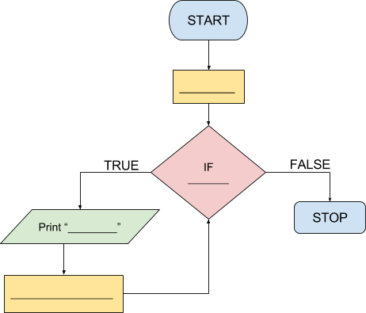

```ngMeta
name: Question 1
completionMethod: peer
```

**Abhi tak humne sirf flowcharts banaye hai. Aage waale questions mein apne program ka flowchart aur python code dono submit karna hai.**

0 se 10 tak numbers print karne ka flowchart aur code submit karein.	

