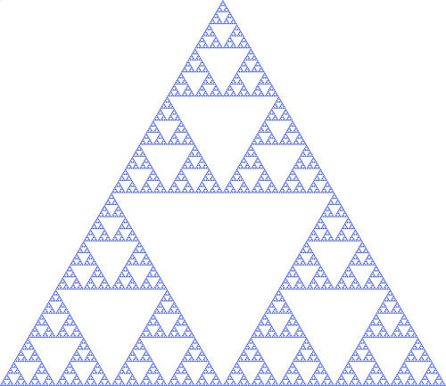

# Recursions

## Prerequitisites

Iss course ko karne ke liye aapke paas inn concepts ki solid understanding honi chahiye:

1 - Functions
2 - Loops, If-Else Conditions, Operators, Booleans, etc.

Yeh image dekho



Iss image mei triangle ke andar triangle ke andar triangle hai... Yeh ek tarah se triangles ki `recursion` hai. Saral shabdo mei agar aap kisi cheez ko, ussi hi cheez ke terms mei express kar sakte hai toh usse recursion kehte hai. Jaise ki yeh numbers dekho :

1, 2, 4, 8, 16, 32, 64, 128, 256

Ab yeh code dekho

```python
def twopowers(number):
    if number==1:
        return 1
    return 2 * twopowers(number-1)

index=1
while(index<10):
    print(twopowers(index))
    index+=1
```

Iss code mei `twopowers` function mei `twopowers` function ko hi call kar rahe hai. Ek tarah se yeh function apni value nikalne ke liye, khud ko hi call kar raha hai. 

Kyuki function khud ko hi baar baar call kar raha hai, kabhi toh function ko value return karni hogi. Isliye hum `base case` add karte hai. Jaise humne iss program mei likha ki agar `number` ki value `1` hai toh, `1` return kar do.

Toh ab program mei jab hum `twopowers(5)` call karte hai, toh woh `2 * twopowers(4)` return kar deta hai.
Par iss expression ko calculate karne ke liye `twopowers(4)` ki value chahiye, isliye woh uss value ka wait karta hai.

Toh ab program mei jab hum `twopowers(4)` call karte hai, toh woh `2 * twopowers(3)` return kar deta hai.
Par iss expression ko calculate karne ke liye `twopowers(3)` ki value chahiye, isliye woh uss value ka wait karta hai.

Toh ab program mei jab hum `twopowers(3)` call karte hai, toh woh `2 * twopowers(2)` return kar deta hai.
Par iss expression ko calculate karne ke liye `twopowers(2)` ki value chahiye, isliye woh uss value ka wait karta hai.

Toh ab program mei jab hum `twopowers(2)` call karte hai, toh woh `2 * twopowers(1)` return kar deta hai.
Par iss expression ko calculate karne ke liye `twopowers(1)` ki value chahiye, isliye woh uss value ka wait karta hai.

Toh ab program mei jab hum `twopowers(1)` call karte hai, toh woh `1` return kar deta hai. **BASE CASE CONDITION**

Ab kyuki `twopowers(1)` ki value pata hai. Toh `2 * twopowers(1)` ki value calculate ho kar 2 * 1 = `2` pata chal jaati hai. Yeh `twopowers(2)` ki value hai.

Ab kyuki `twopowers(2)` ki value pata hai. Toh `2 * twopowers(2)` ki value calculate ho kar 2 * 2 = `4` pata chal jaati hai. Yeh `twopowers(3)` ki value hai.

Ab kyuki `twopowers(3)` ki value pata hai. Toh `2 * twopowers(2)` ki value calculate ho kar 2 * 4 = `8` pata chal jaati hai. Yeh `twopowers(4)` ki value hai.

Ab kyuki `twopowers(4)` ki value pata hai. Toh `2 * twopowers(3)` ki value calculate ho kar 2 * 8 = `16` pata chal jaati hai. Yeh `twopowers(5)` ki value hai.

Isliye `twopowers(5)` ka answer 16 hai.