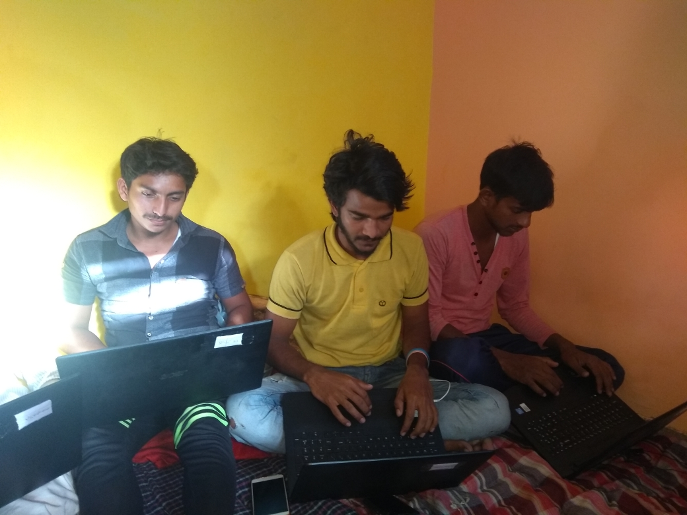

```ngMeta
name: What is Pair Programming
completionMethod: manual
```

## PAIR PROGRAMMING
Formally , one programmer is the driver and write codes. The other is the observer or the navigator who reviews each line of code as it is typed in. Jab programmers pair programming karte hai toh unse unki understanding better hoti hai and ek problem ya phir  ek task ko wo different method se solve kar sakte hai………



PAIR PROGRAMMING KE BAARE MAIN AUR ADHIK JAANE KE LIYE IS VIDEO KO DEKHE

@[youtube](YhV4TaZaB84)

## ADVANTAGES OF PAIR PROGRAMMING
(1) Two heads are better than one.
(2) More efficents.
(3) Fewer Coding Mistakes.
(4) An effective way to share Knowledge  
(5) Develops your staff’s interpersonal skills.

### Ab aapko 30 mins ke liye aapas mei english mei baat karni hai.

Baat karte karte, aap observe karein, ki aap kitne tech words use kar paa rahe hai.

Aur agar aapka partner koi aisa tech word bolta hai, jo aapko nahi pata, ya aap generally use nahi kartein. Inn words ko bhi samajhne ki phir koshish karein.

Iss discussion ko karte hue, aap inn points ke baarein mei bhi soch sakte hai:

1. Pair programing kya hoti hai?
2. Pair programing karne se programers ko kya fayada hote hai?
