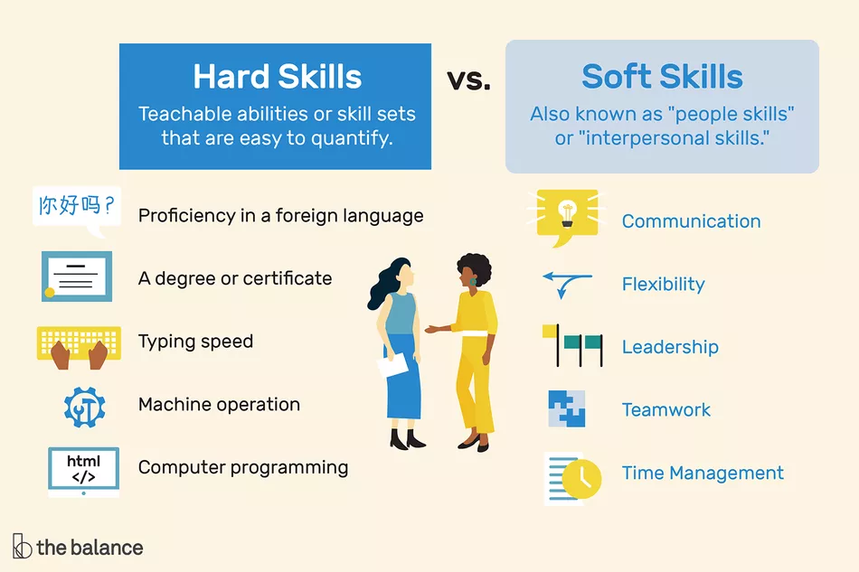

# What is Soft-Skill?
The term soft skills refers to the personal traits, characteristics and competencies that inform to how an individual relates to others and is often used as a synonym for people skills or interpersonal skills.

The term describes those personal attributes that indicate a high level of emotional intelligence. These skills can include empathy, analytical thinking and etiquette. Soft skills are attributes that are impossible to quantify but play an important factor in many business settings.

## Why is it Important to Develop Soft Skills?
Soft skills are an essential part of finding, attracting, and retaining clients. Highly-developed presentation skills, networking abilities, and etiquette awareness can help you win new clients and gain more work from existing clients. Honing your abilities to resolve conflicts, solve problems, and provide excellent customer service can lead to stronger relationships with colleagues, vendors, and other professional contacts. Ultimately, strong soft skills can help you gain confidence—an invaluable trait in the business world.

On the other hand, a lack of soft skills can limit your potential, or even be the downfall of your business. By developing strong leadership, teamwork, and communication abilities, you can run projects more smoothly, deliver results that please everyone, and even positively influence your personal life by improving how you interact with others.

### There are several examples of soft skills that company leaders value:

* ambition
* self-management skills
* time-management
* confidence
* friendliness and manners
* enthusiasm and optimism
* focus
* common sense
* empathy
* situational awareness

## How Do You Develop Your Soft Skills?
A great first step in personal development is to recognize and acknowledge the areas in which you need to improve. This can take place through personal reflection and introspection, an evaluation of your business’s performance deficiencies, or through feedback from trusted colleagues or friends. You may find that daily journaling regarding your professional interactions and their outcomes is helpful self-evaluation.

After you’ve gained an awareness of your strengths and weaknesses, create a plan of action for improvement that aligns with and supports your business plan. Because soft skills encompass a relatively large category, there are a number of ways to develop or enhance these skills. Consider working with a mentor who can provide feedback and model appropriate skills. If your focus is on improving communication, courses in subjects like public speaking or joining a group such as Toastmasters can be helpful.

Finally, although it may seem deceptively simple, don’t underestimate the effect of positivity and optimism. After all, the majority of soft skills are bolstered by confidence and enthusiasm, and undermined by anxiety, insecurity, and negativity. Changing your mindset so you are able to see the positive in situations can have a significant impact on how you interact with others.

