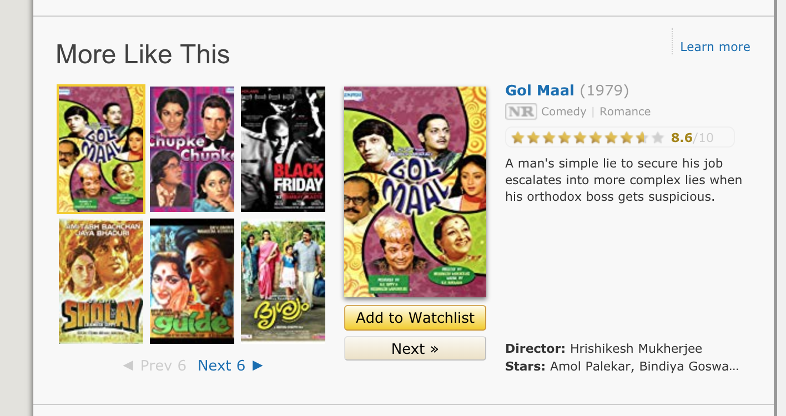

```ngMeta
name: Bonus Task 1

```

# Bonus Task 1

Iss course mein kuch bonus tasks hain. Yeh tasks karne aapko compulsory nahi hain lekin agar aap try karoge toh aapko kaafi maza aayega :)

IMDB pe har movie ki kuch similar movies di hoti hain. Har movie ke saath kuch similar movies ki list hoti hai. Jaise Anand wale page pe yeh uski similar movies ki list hai:



Iss task mein aap `scrape_movie_details` wale function ko edit kar sakte ho ki woh similar movies ki list bhi scrape kare. Ek achi coding practice yeh hogi ki aap jab similar movies ki list scrape kar rahe ho toh aap uss list ko ID ke hisaab se store kar rahe ho aur na ki sirf naam ke hisaab se.

## Hint

Similar movies waali list mein har movie ka link hai aur uss link mein uss movie ka link hai. Aur iss link mein uss movie ki IMDB ke hisaab se ID hai.
