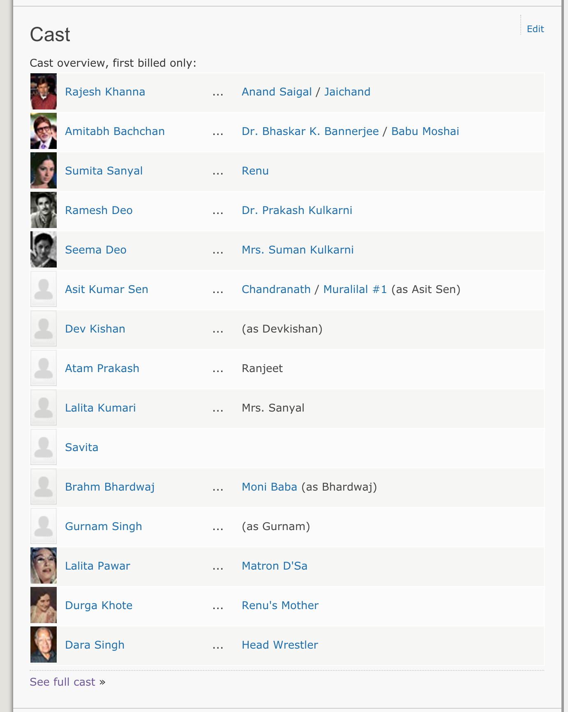
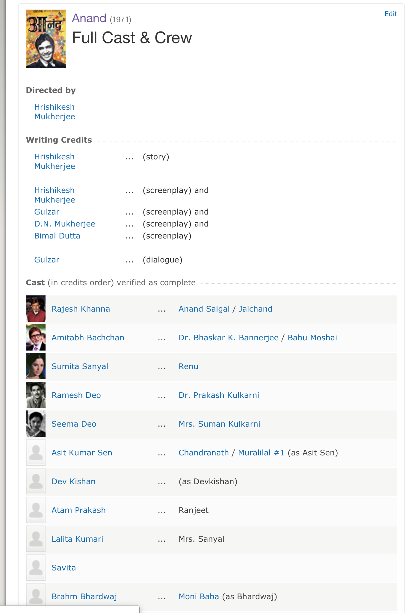

```ngMeta
name: Task 12
submissionType:url
```

# Task 12

Abhi humne har movie ki detail toh nikaal li hai. Lekin abhi humare paas har movie mein kaunse actors aur actresses ne act kia, uski details nahi hain. Dekho jaise Agar anand ke page pe neeche scroll karoge toh yeh saari cast ki details di hui hain:



Lekin yahan poori details nahi di hui. Agar aap *See Full Cast* waale link pe click karoge toh aapko woh ek alag page pe leke jayega jahan saari cast ki details di hui hain. Uss page pe jaake humein poori cast ki details mil jayengi.

Woh page kuch aisa dikhega.



Humein yahan se saari cast ki details nikaalni hai. Ek `scrape_movie_cast` naam ka ek function likho jo `movie_caste_url` naam ka parameter le jismein kisi bhi movie ke caste waale page ka link hona chaiye. Jaise Anand ke caste wale page ka link yeh hai, https://www.imdb.com/title/tt0066763/fullcredits?ref_=tt_cl_sm#cast

Aapke iss function ko caste ka data iss tareeke se return karna hai:

```python
[
  {
    "imdb_id": "nm0004435",
    "name": "Rajesh Khanna"
  },
  {
    "imdb_id": "nm0000821",
    "name": "Amitabh Bachan"
  }
]
```

Dekho ki kaise `imdb_id` mein uss actor ki ID hai IMDB ke hisaab se. Dekho ki actor ke naam pe ek link hai. Jaise **Rajesh Khanna** ka link hai `https://www.imdb.com/name/nm0004435/?ref_=ttfc_fc_cl_t1` Iss link mein uski ID **`nm0004435`** hai. Wahan se `imdb_id` waali key ki value aa rahi hai. Aapko thodi si string manipulation kar ke woh ID nikaalni padegi.

Aapko yeh bhi ensure karna hai ki yeh function caching ka use kare. Matlab ek baar jab yeh data le aaye toh uski JSON store kar le. Aur fir aage se data IMDB sa na mangwa ke directly aapki JSON mein se nikaal le. Jaise agar aap anand ki caste ki details nikaal rahe ho toh aapki cache waali file ka naam `"tt0066763_cast.json"` hona chaiye. Kyunki Anand ki ID `tt0066763` hai. Yeh ID aapka function cast wale url se nikaal sakta hai. Anand ka caste wala URL yeh hai: https://www.imdb.com/title/tt0066763/fullcredits?ref_=tt_cl_sm#cast
