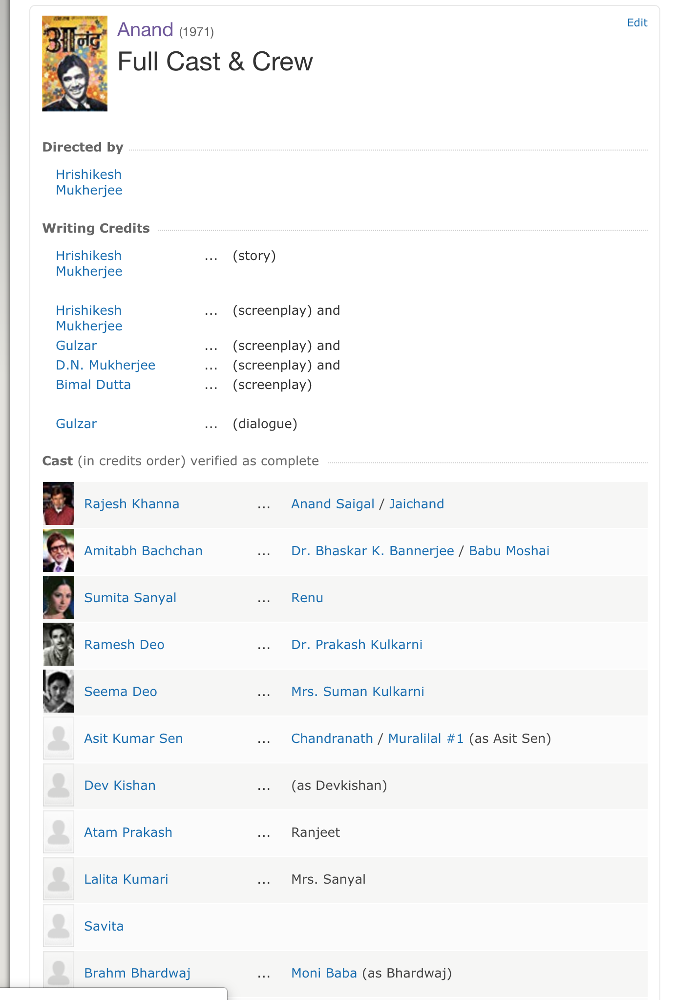

```ngMeta
name: Task 14

```

# Task 14

Saari movies ke cast wale page pe lead actors aur actresses ki list top pe di hoti hai. Jaise Anand ka caste page kuch aisa dikhta hai.



List mein jinn actors/actresses ka naam pehle hota hai woh lead actors hote hain generally. Jo movie mein kam dikhte hain unka naam neeche hota hai. Humne yeh dekhna hai ki kaunse actors/actresses ke saath kaun kaun act karta hai? Toh humein aisa code likhna hai jo yeh wale questions answer kar paye:

1. Amitabh Bachan ke saath kaunse actors aur actresses sabse zyada act karte hain?
2. Deepika Padukone ke saath kaun kaun si actors/actresses sabse zyada act karte hain?

Lekin abhi apne analysis ko asaan banane ke liye hum har movie ke top ke 5 actors/actresses ki baat karenge. Uske neeche wale pe aap baad mein analysis kar ke dekh sakte ho?

Yeh karne ke liye aapko ek `analyse_co_actors` naam ka function likhna hai jo ki `movies_list` naam ka ek parameter lega. Iss parameter mein saari movies aur unki cast ki list hogi. Basically jo list aapka updated `get_movie_list_details` wala function return karta hai woh iss function mein parameter ki tarah jayegi. Iss list mein har movie ki details ke saath saath uski cast ki details bhi honi chaiye. Yeh `movies_list` kuch aisi dikhegi:

```python
[
  {
    "name": "Anand"
    "director": ["Hrishikesh Mukherjee"],
    "country": "India",
    "language": ["Hindi"],
    "poster_image_url": "https://m.media-amazon.com/images/M/MV5BNmZkMTMzNmEtMWU5NC00MjEzLWE5MzktYzRlMmQyMzk0YmM1XkEyXkFqcGdeQXVyNTA4NzY1MzY@._V1_UX182_CR0,0,182,268_AL__QL50.jpg",
    "bio": "The story of a terminally ill man who wishes to live life to the full before the inevitable occurs, as told by his best friend.",
    "runtime": 183,
    "genre": [
    	"Drama"
    ]
    "cast": [
      {
        "imdb_id": "nm0004435",
        "name": "Rajesh Khanna"
      },
      {
        "imdb_id": "nm0000821",
        "name": "Amitabh Bachan"
      },
      {},
      {},
      {},
      {}
    ]
  },
  {},
  {},
  {},
  {}
]
```

Yeh list leke aapke function ko ek dictionary return karni hai jiska structure kuch aisa hoga:

```python
{
  "nm0004435": {
    "name": "Rajesh Khanna",
    "frequent_co_actors": [
      {
        "imdb_id": "nm0000821",
        "name": "Amitabh Bachan"
        "num_movies": 2
      }
    ]
  },
  "nm0000821": {
    "name": "Amitabh Bachan",
    "frequent_co_actors": [
      {}, {}, {}
    ]
  }
}
```

Iss dictionary mein dekho kaise top level pe actors ki IMDB ki ID hai aur naam nahi. ID humesha unique hoti hai lekin shayad kuch do logon ke naam same ho sakte hain. Isliye jab bhi aap code likh rahe ho toh koshish karo ki ID ke basis pe apni conditions likh rahe ho aur naam ke hisaab se nhi.

Isko samjhne ke liye Facebook pe apne naam ki Search Karo. Aapko hundreds of log milenge jinka shayad aapke vala naam hai. Lekin Facebook ke liye sab alag hai. Woh isliye hai kyunki FB unki ID ke hisaab se code likhta hai aur na hi naam ke hisaab se.

Top level pe IMDB ID waali ek key jiski value mein bhi ek aur dictionary hai. Iss dictionary mein uss actor ka naam hai jiski woh ID hai `"name"` naam ki ek key mein. Fir ek `frequent_co_actors` ki list hai. Iss list mein kuch dictinaries hain. Jinmein yeh sab data hai:

1. `name`: Uss actor ka naam jo Rajesh Khanna ke saath acting karta hai.
2. `imdb_id`: Uss actor ki IMDB ID jiska naam likha hua hai.
3. `num_movies`: Total kitni movies mein woh actor `"Rajesh Khanna"` ke saath aaya hai.

Remember abhi ke liye aapne saari 250 movies ki caste ke top 5 members pe hi aapne yeh analysis run karna hai.

## Bonus

Python mein ek Plotly naam ki library hoti hai. Aap usse kuch interesting graphs plot kar sakte ho. Aap uska use kar ke apne analysis ke around kuch ache graphs plot kar sakte ho.
